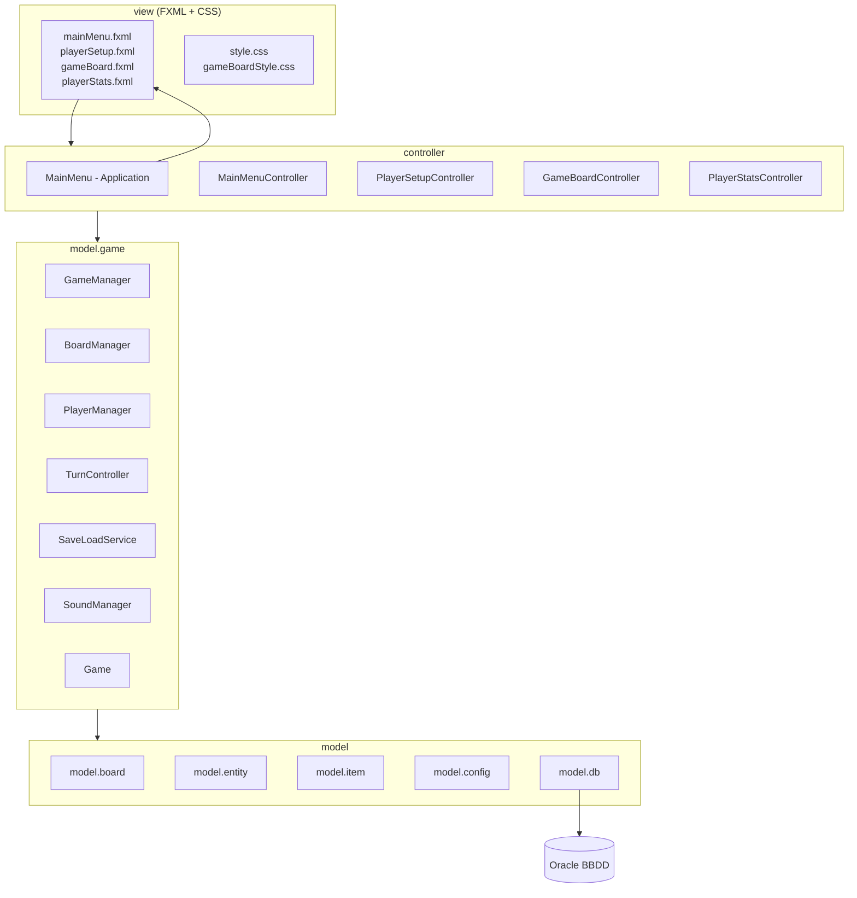
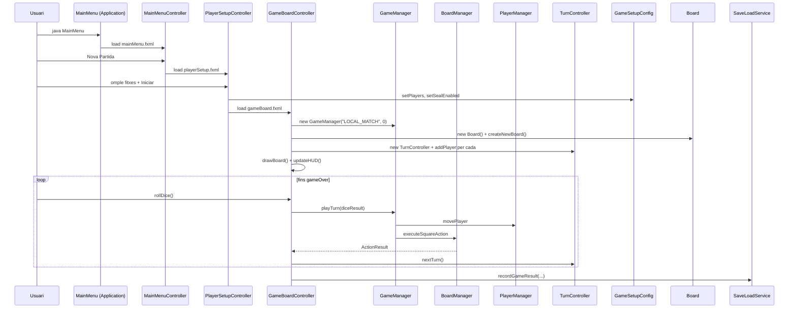

# Arquitectura General

El projecte segueix una variant **MVC** clàssica adaptada a JavaFX amb FXML:

- **Model** — paquets `model.*` (lògica, dades, persistència).
- **View** — fitxers FXML + CSS sota `view.fxml/` i `assets/css/`.
- **Controller** — classes Java sota `controller.*` que connecten els FXML amb el model.

## Vista de mòduls

## Cicle de vida d'una partida

## Capes i responsabilitats

| Capa | Paquets | Responsabilitat |
|------|---------|-----------------|
| **Vista** | `view.fxml`, `assets/css` | Descripció declarativa de la UI |
| **Controlador UI** | [[Paquet controller]] | Bind FXML ↔ model, gestió d'events JavaFX |
| **Coordinador** | [[Paquet model.game]] (`GameManager`, `BoardManager`, `PlayerManager`) | Regles del joc |
| **Estat del joc** | [[Paquet model.game]] (`Game`, `TurnController`) | Estructures vives |
| **Domini** | [[Paquet model.board]], [[Paquet model.entity]], [[Paquet model.item]] | Tauler, jugadors, objectes |
| **Configuració** | [[Paquet model.config]] | Idiomes (`Lang`/`LangConfig`), criptografia (`CryptoUtil`), bag de setup (`GameSetupConfig`) |
| **Persistència** | [[Paquet model.db]] (`BBDD`) + `SaveLoadService` | Connexió Oracle + serialització YAML |

## Punts d'entrada

- **`controller.main.MainMenu.main()`**: bootstrap. Carrega l'idioma per defecte i invoca `Application.launch()`.
- **`view.ui.BBDDPanel.main()`**: utilitat secundària per provar les operacions CRUD contra Oracle (no és part del joc).

## Patrons utilitzats

| Patró | On |
|-------|----|
| **MVC** | Global |
| **Singleton** | `LangConfig`, `SoundManager` |
| **Template Method** | `Square.action(player)` abstracte amb subclasses `S_*` |
| **Strategy** (via *switch*) | `BoardManager.executeSquareAction` |
| **Observer / Listener** | `LangConfig.addLanguageChangeListener` |
| **Data Transfer Object** | `ActionResult` (DTO entre lògica i UI) |

## Decisions de disseny destacades

> [!info] Per què `GameSetupConfig` és estàtic?
> Els controllers JavaFX són instanciats pel `FXMLLoader`, així que passar estat directament entre `PlayerSetupController` i `GameBoardController` és incòmode. Una classe estàtica fa de "bossa" temporal.

> [!warning] Una sola finestra
> Tot el joc viu en una **única `Stage`** que canvia d'`Scene` segons la pantalla. Això facilita la lògica de música (`SoundManager`) i el redimensionament.

> [!tip] Cap *thread* de fons
> Tota la lògica corre al **JavaFX Application Thread**. Les animacions utilitzen `Timeline` / `PauseTransition`, no fils separats.

## Enllaços relacionats

- [[Estructura de Paquets]] — mapa detallat de paquets
- [[Diagrama de Classes]] — UML general
- [[Flux de Joc]] — seqüències detallades
