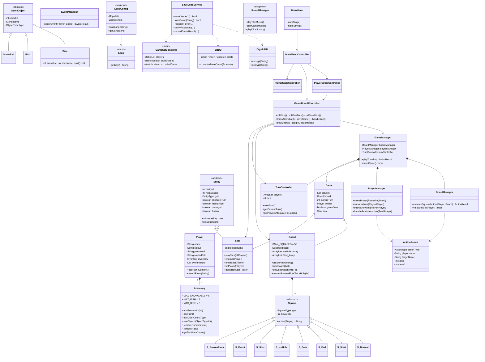
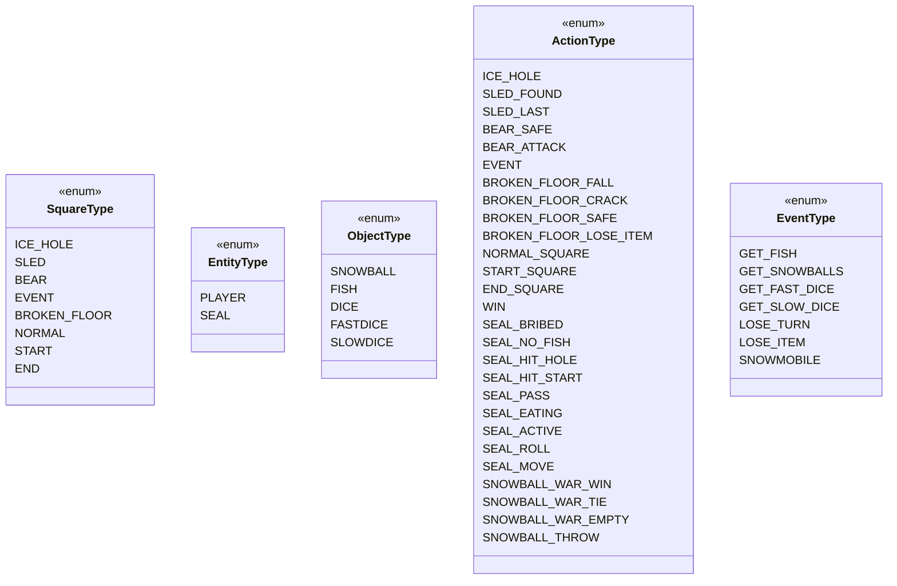

# Diagrama de Classes

UML general (simplificat) de les classes principals del joc. Per veure detalls per paquet, consulta les pàgines individuals.

## Visió completa

## Enums

## Patrons identificats

| Patró | Implementació |
|-------|---------------|
| **MVC** | `view/`, `controller/`, `model/` |
| **Singleton** | `LangConfig`, `SoundManager` |
| **Template Method** | `Square` abstracta amb `action()` redefinit per subclasses |
| **Strategy via switch** | `BoardManager.executeSquareAction` triant handler per `SquareType` |
| **Observer / Listener** | `LangConfig.listeners` notifica controllers en canviar idioma |
| **DTO** | `ActionResult` viatja de motor a UI |
| **Static Configuration Bag** | `GameSetupConfig` |
| **Lazy initialization** | `SoundManager.getInstance()`, `LangConfig.getInstance()` |

## Enllaços relacionats

- [[Estructura de Paquets]] — mapping disc → classes
- [[Paquet model.board]] · [[Paquet model.entity]] · [[Paquet model.item]] · [[Paquet model.game]]
- [[Arquitectura General]]
