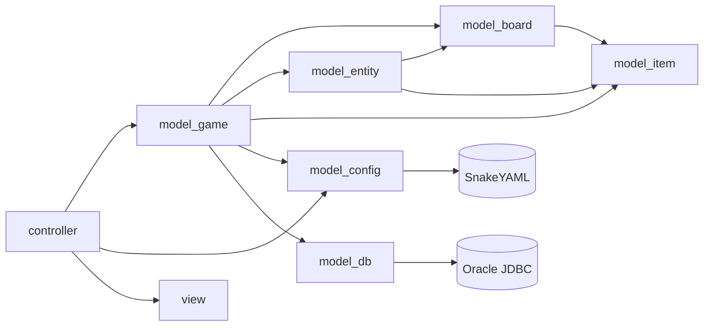

# Estructura de Paquets

El projecte segueix una jerarquia clara. Cada paquet té una pàgina pròpia amb el detall.

```
src/
├── module-info.java
├── controller/
│   ├── main/MainMenu.java               ← entry point
│   └── ui/                              ← controllers FXML
│       ├── MainMenuController.java
│       ├── PlayerSetupController.java
│       ├── GameBoardController.java      (≈1780 línies)
│       └── PlayerStatsController.java
├── model/
│   ├── board/                           ← tauler + caselles
│   │   ├── Board.java
│   │   ├── Square.java                  (abstracte)
│   │   ├── SquareType.java              (enum)
│   │   ├── EventManager.java
│   │   └── squares/
│   │       ├── S_Normal.java  S_Start.java  S_End.java
│   │       ├── S_Bear.java    S_IceHole.java
│   │       ├── S_Sled.java    S_BrokenFloor.java
│   │       └── S_Event.java
│   ├── entity/                          ← pingüins + foca
│   │   ├── Entity.java                  (abstracte)
│   │   ├── EntityType.java              (enum)
│   │   ├── Player.java
│   │   └── Seal.java
│   ├── item/                            ← objectes / inventari
│   │   ├── GameObject.java              (abstracte)
│   │   ├── ObjectType.java              (enum)
│   │   ├── Inventory.java
│   │   └── objects/
│   │       ├── Dice.java
│   │       ├── Fish.java
│   │       └── SnowBall.java
│   ├── game/                            ← coordinadors / persistència
│   │   ├── Game.java
│   │   ├── GameManager.java
│   │   ├── BoardManager.java
│   │   ├── PlayerManager.java
│   │   ├── TurnController.java
│   │   ├── ActionResult.java
│   │   ├── SaveLoadService.java
│   │   └── SoundManager.java
│   ├── config/                          ← localització + crypto + bag de setup
│   │   ├── Lang.java                    (enum claus de traducció)
│   │   ├── LangConfig.java              (singleton de l'idioma)
│   │   ├── GameSetupConfig.java         (bag estàtic)
│   │   └── CryptoUtil.java              (AES-128)
│   └── db/
│       └── BBDD.java                    (Oracle helper del curs)
├── view/
│   ├── ui/BBDDPanel.java                (test manual de BBDD)
│   └── fxml/
│       ├── mainMenu.fxml      ← MainMenuController
│       ├── playerSetup.fxml   ← PlayerSetupController
│       ├── gameBoard.fxml     ← GameBoardController
│       └── playerStats.fxml   ← PlayerStatsController
└── assets/
    ├── css/style.css · gameBoardStyle.css
    ├── lang/<codi>.yml
    ├── sprites/...
    ├── sounds/main_screen_music.wav · bg_music.wav · dice.wav · ...
    └── font/pixel-game.regular.otf · pixel-game.extrude.otf · pixel-unicode-regular.ttf
```

## Mòdul Java (`module-info.java`)

```java
module JocDelPingu {
    requires org.yaml.snakeyaml;
    requires java.sql;
    requires java.desktop;

    requires javafx.graphics; javafx.controls; javafx.fxml;
    requires javafx.swing;    javafx.base;     javafx.media;

    opens controller.main to javafx.graphics, javafx.fxml;
    opens controller.ui   to javafx.fxml, javafx.graphics;
    opens view.ui         to javafx.fxml, javafx.graphics;
    opens view.fxml       to javafx.fxml, javafx.graphics;
    opens assets.css      to javafx.graphics, javafx.fxml;

    exports controller.main; exports controller.ui; exports view.ui;
    exports model.board; exports model.board.squares;
    exports model.config; exports model.db;
    exports model.entity;
    exports model.game;
    exports model.item;  exports model.item.objects;
}
```

> [!warning] `opens` vs `exports`
> `opens` permet a JavaFX accedir per reflexió als controllers (necessari per a `@FXML`). `exports` permet l'accés normal des d'altres mòduls.

## Relacions entre paquets



## Pàgines detallades per paquet

| Paquet | Pàgina |
|--------|--------|
| `model.board` (+ `.squares`) | [[Paquet model.board]] |
| `model.entity` | [[Paquet model.entity]] |
| `model.item` (+ `.objects`) | [[Paquet model.item]] |
| `model.game` | [[Paquet model.game]] |
| `model.config` | [[Paquet model.config]] |
| `model.db` | [[Paquet model.db]] |
| `controller.*` | [[Paquet controller]] |
| `view.*` + FXML + CSS | [[Paquet view]] |

## Enllaços relacionats

- [[Arquitectura General]] — visió MVC
- [[Diagrama de Classes]] — UML general
