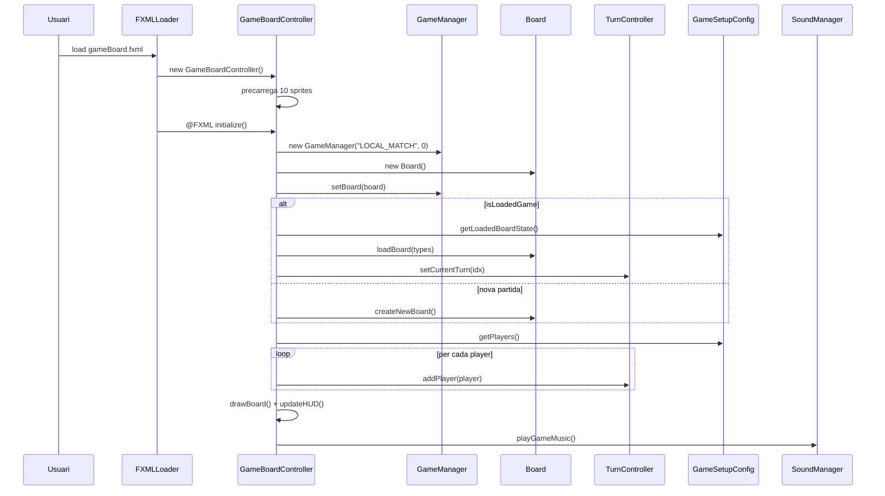
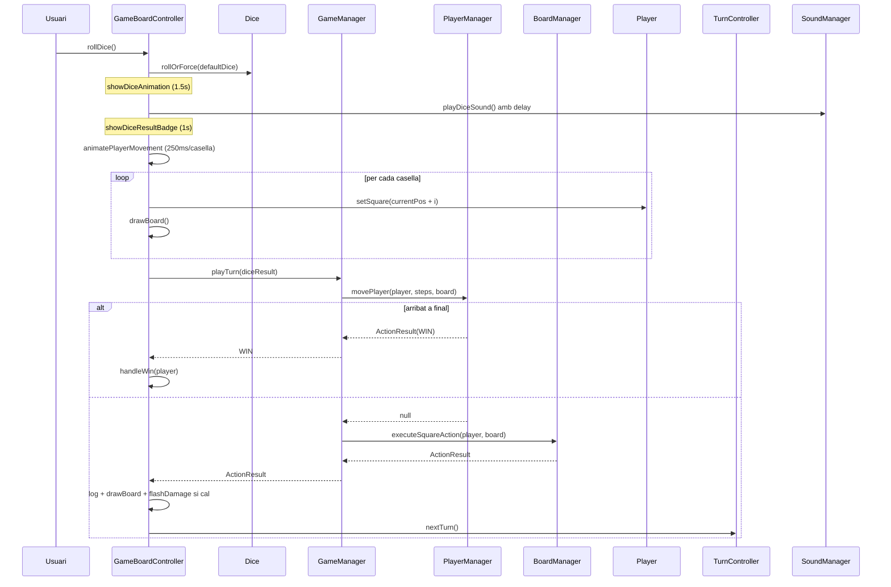
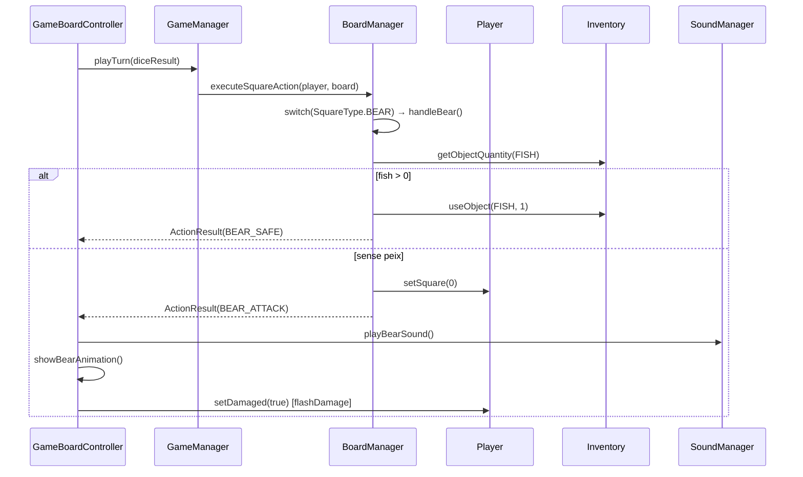
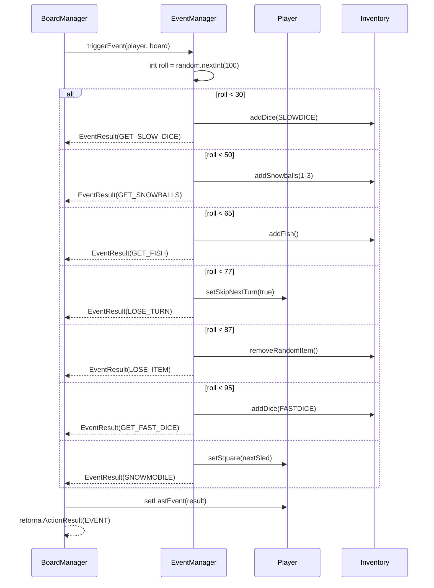
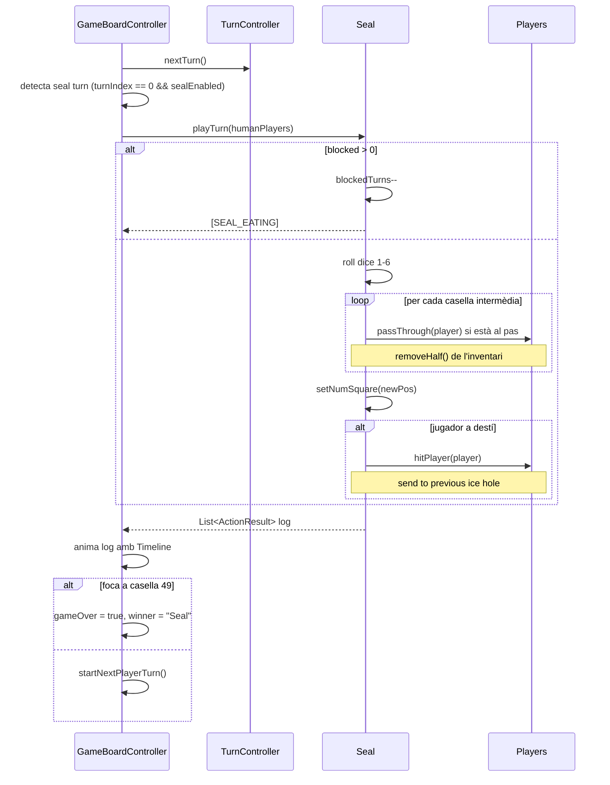
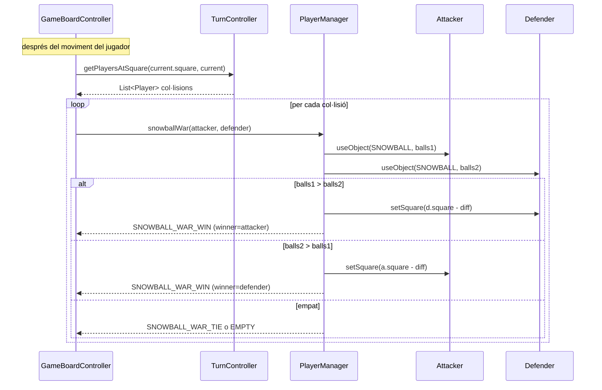
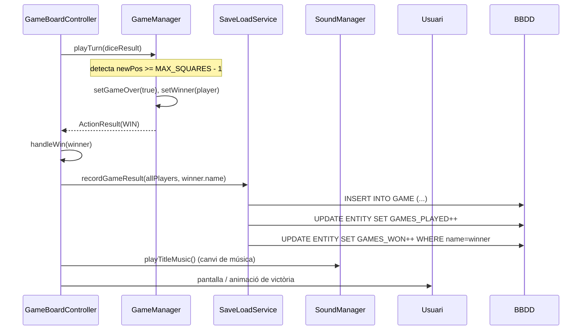
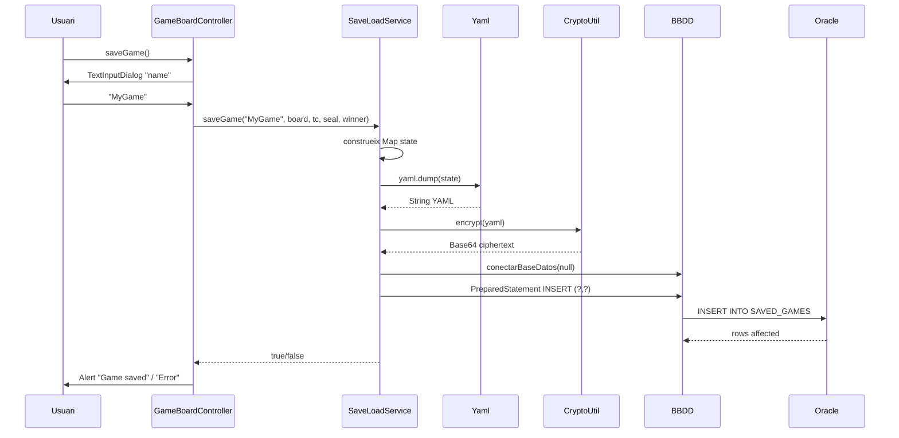
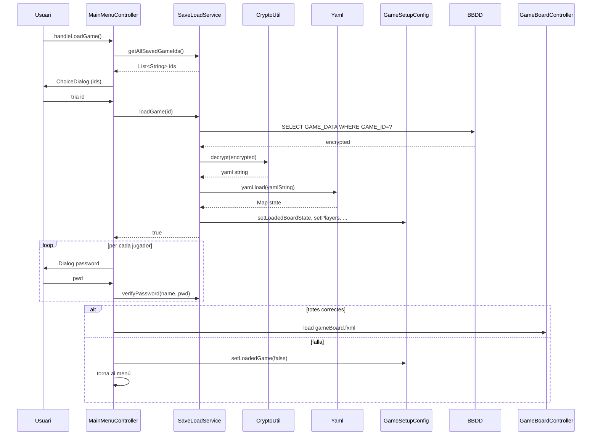

# Flux de Joc

Diagrames de seqüència per a les operacions més importants del joc.

## 1. Inicialització de la partida

## 2. Tirada de daus i moviment

## 3. Caure en una casella especial (BEAR)

## 4. Casella EVENT amb subllançament aleatori

## 5. Torn de la foca CPU

## 6. Snowball war (col·lisió de jugadors)

## 7. Victòria

## 8. Guardat de partida

## 9. Càrrega de partida

## Enllaços relacionats

- [[Arquitectura General]] — visió MVC
- [[Paquet model.game]] — coordinadors
- [[Paquet controller]] — `GameBoardController`
- [[Caselles Especials]] — efecte de cada casella
- [[Sistema de Persistència]] — detalls del guardat
