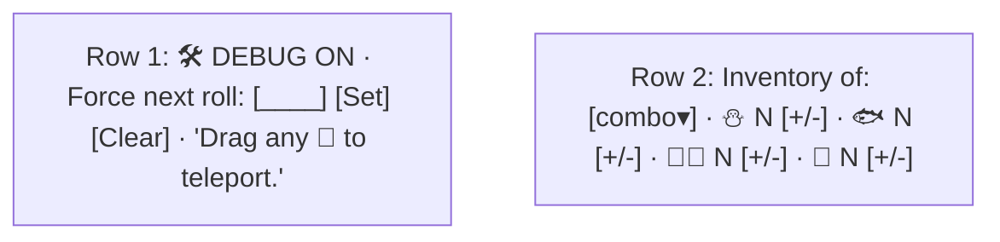

# Mode Debug Tècnic

Documentació interna de la funcionalitat **Ctrl+Shift+D** del [[Tauler de Joc]]. Codi tot al fitxer `GameBoardController.java`.

## Activació amb un Event Filter

L'avantatge dels *event filters* sobre els *handlers* convencionals és que **es disparen abans** del processament normal, permetent interceptar combinacions de tecles globalment sense haver d'estar a un widget concret amb focus.

```java
mainStack.sceneProperty().addListener((obs, oldScene, newScene) -> {
    if (newScene != null) {
        newScene.addEventFilter(KeyEvent.KEY_PRESSED, ev -> {
            if (ev.isControlDown() && ev.isShiftDown() && ev.getCode() == KeyCode.D) {
                toggleDebugMode();
                ev.consume();
            }
        });
    }
});
```

> [!info] Per què `sceneProperty().addListener`?
> Quan el controller s'inicialitza, l'`Scene` encara no està assignada al `Stage`. Esperem l'assignació via el listener i, llavors, registrem el filtre.

## `toggleDebugMode()`

```java
private void toggleDebugMode() {
    debugMode = !debugMode;
    if (debugPanel == null) buildDebugPanel();
    debugPanel.setVisible(debugMode);
    debugPanel.setManaged(debugMode);
    if (debugMode) {
        populateDebugPlayerCombo();
    } else {
        debugForcedDice = null;
        updateDebugBanner();
    }
    drawBoard();   // refresca els tokens per afegir/treure drag handlers
}
```

## Construcció del panell

`buildDebugPanel()` crea un `VBox` amb 2 files i l'apila al `mainStack` amb alineació `TOP_CENTER`:



Estil inline (no usa el CSS general):

```java
debugPanel.setStyle("-fx-background-color: rgba(0,0,0,0.85); -fx-padding: 6 14;");
StackPane.setAlignment(debugPanel, Pos.TOP_CENTER);
```

## Forçar valor del dau

Variable `Integer debugForcedDice` (nullable):

```java
private int rollOrForce(Dice dice) {
    if (debugForcedDice != null) {
        int v = debugForcedDice;
        debugForcedDice = null;   // un sol ús
        updateDebugBanner();
        return v;
    }
    return dice.roll();
}
```

Tots tres handlers (`rollDice`, `rollFastDice`, `rollSlowDice`) passen el dau a `rollOrForce()` perquè el valor forçat sobreescrigui qualsevol tipus de dau.

Rang acceptat al setter: **1-50** (perquè inclou tot el tauler).

```java
int v = Integer.parseInt(diceField.getText().trim());
if (v >= 1 && v <= 50) {
    debugForcedDice = v;
    updateDebugBanner();
    diceField.clear();
}
```

## Drag & drop dels pingüins

Cada vegada que `drawBoard()` renderitza un pingüí en mode debug, li afegeix tres handlers:

```java
private void attachDebugDragHandlers(StackPane playerToken, Player player) {
    playerToken.setCursor(Cursor.OPEN_HAND);
    final double[] startTranslate = new double[2];
    final double[] startMouse = new double[2];

    playerToken.setOnMousePressed(e -> { ... });
    playerToken.setOnMouseDragged(e -> { ... });
    playerToken.setOnMouseReleased(e -> { ... });
}
```

### Press

```java
startTranslate[0] = playerToken.getTranslateX();
startTranslate[1] = playerToken.getTranslateY();
startMouse[0] = e.getSceneX();
startMouse[1] = e.getSceneY();
playerToken.setCursor(Cursor.CLOSED_HAND);

// Lift the parent cell so drag-over funciona per sobre de caselles posteriors
Node parentCell = playerToken.getParent();
if (parentCell != null) parentCell.toFront();
playerToken.toFront();
```

> [!warning] Per què `toFront()`?
> `GridPane` renderitza els fills en ordre d'inserció: les caselles amb índex més alt es dibuixen damunt. Si no portem la cel·la actual al davant, en arrossegar cap endavant l'sprite queda **tapat** per cel·les que encara no hem trepitjat.

### Drag

Actualitza `translateX/Y` per moure visualment el sprite:

```java
double dx = e.getSceneX() - startMouse[0];
double dy = e.getSceneY() - startMouse[1];
playerToken.setTranslateX(startTranslate[0] + dx);
playerToken.setTranslateY(startTranslate[1] + dy);
```

### Release

```java
int targetIndex = findCellIndexAt(e.getSceneX(), e.getSceneY());
if (targetIndex >= 0) {
    player.setSquare(targetIndex);
    logEvent("🛠 DEBUG: " + player.getName() + " teleported to square " + targetIndex);
}
playerToken.setCursor(Cursor.OPEN_HAND);
drawBoard();   // redibuixa des de zero (això elimina els translates temporals)
```

## Càlcul de l'índex de cel·la sota el cursor

`findCellIndexAt(sceneX, sceneY)` recorre els fills del grid:

```java
int cols = Board.widthBoard;
for (Node child : grid.getChildren()) {
    Bounds b = child.localToScene(child.getBoundsInLocal());
    if (b.contains(sceneX, sceneY)) {
        Integer col = GridPane.getColumnIndex(child);
        Integer row = GridPane.getRowIndex(child);
        if (col != null && row != null) {
            return row * cols + (row % 2 == 0 ? col : cols - 1 - col);
        }
    }
}
return -1;
```

> [!info] Reconversió snake → linear
> La fórmula `row * cols + (row % 2 == 0 ? col : cols - 1 - col)` reverteix el patró de serp del tauler: per a files senars, la columna `col` representa la posició a l'**inrevés** dins la fila.

## Editor d'inventari

Per cada tipus d'objecte hi ha botons `+` i `−` connectats a `tweakInventory(type, delta)`:

```java
private void tweakInventory(ObjectType type, int delta) {
    Player p = findDebugSelectedPlayer();
    if (p != null) {
        Inventory inv = p.getInventory();
        if (delta > 0) {
            switch (type) {
                case SNOWBALL: inv.addSnowballs(1); break;
                case FISH:     inv.addFish();      break;
                case FASTDICE: inv.addDice(ObjectType.FASTDICE); break;
                case SLOWDICE: inv.addDice(ObjectType.SLOWDICE); break;
                default: break;
            }
        } else if (inv.getObjectQuantity(type) > 0) {
            inv.useObject(type, 1);
        }
        refreshDebugInventoryLabels();
        updateHUD();
        drawBoard();
    }
}
```

> [!tip] Respecta els màxims
> En afegir, es passa per `Inventory.addX()` que tenen els seus propis caps (`MAX_SNOWBALLS=6`, `MAX_FISH=2`, `MAX_DICE=3`). El debug **no fa cheats** contra aquests caps.

## Etiquetes refrescades

`refreshDebugInventoryLabels()` actualitza els 4 labels d'inventari del panel sempre que canvia la selecció del combo o el contingut:

```java
debugSnowballLabel.setText("⛄ " + inv.getSnowballQuantity() + "/" + Inventory.MAX_SNOWBALLS);
debugFishLabel.setText("🐟 "    + inv.getFishQuantity()     + "/" + Inventory.MAX_FISH);
debugFastDiceLabel.setText("🎲✨ " + inv.getFastdiceQuantity());
debugSlowDiceLabel.setText("🎲 "   + inv.getSlowdiceQuantity());
```

## Persistència

> [!warning] El mode no es desa
> El flag `debugMode`, `debugForcedDice` i les configuracions del panell **no formen part del save**. En carregar una partida sempre es comença sense mode debug.

## Enllaços relacionats

- [[Mode Debug]] — vista d'usuari
- [[Paquet controller]] — `GameBoardController`
- [[Sistema de Sprites]] — `drawBoard` és qui afegeix els handlers
