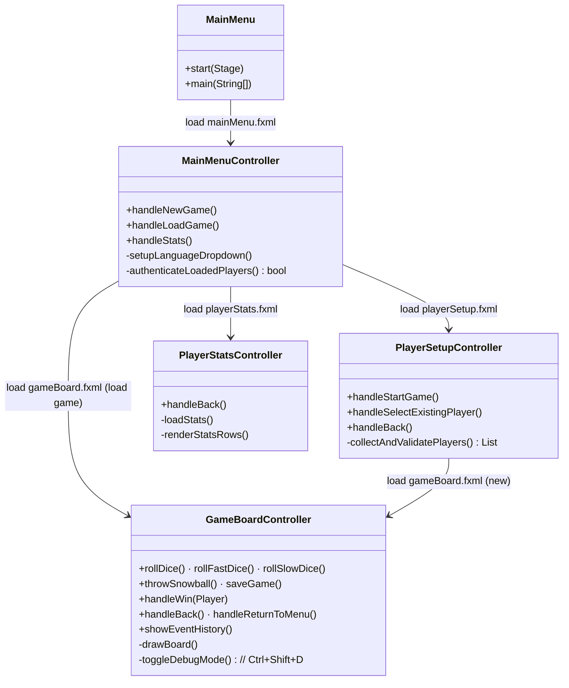
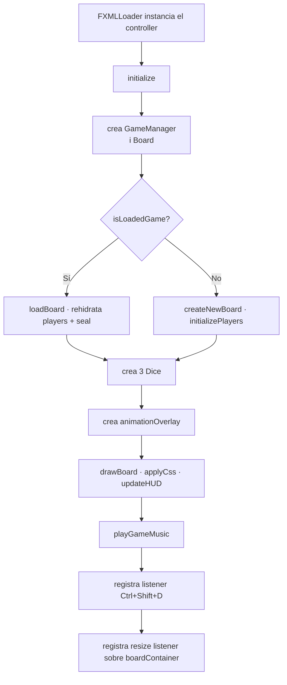

# Paquet `controller`

Conté els *controllers* JavaFX (subpaquet `controller.ui`) i el punt d'entrada de l'aplicació (`controller.main.MainMenu`).

## Classes



## `MainMenu` (Application)

És la classe `extends Application` que aixeca la finestra:

```java
public static void main(String[] args) {
    LangConfig.loadLang();   // carrega l'idioma per defecte
    launch(args);
}

@Override
public void start(Stage primaryStage) throws Exception {
    // Carrega 3 fonts pixel-art
    Font.loadFont(... "/assets/font/pixel-game.regular.otf", 10);
    Font.loadFont(... "/assets/font/pixel-game.extrude.otf", 10);
    Font.loadFont(... "/assets/font/pixel-unicode-regular.ttf", 10);

    FXMLLoader loader = new FXMLLoader(getClass().getResource("/view/fxml/mainMenu.fxml"));
    Parent root = loader.load();
    Scene scene = new Scene(root);
    scene.getStylesheets().add(getClass().getResource("/assets/css/style.css").toExternalForm());

    primaryStage.setScene(scene);
    primaryStage.setWidth(900); primaryStage.setHeight(720);
    primaryStage.setResizable(true);
    primaryStage.setTitle(LangConfig.getLang(Lang.TEXT_GAME_TITLE));
    primaryStage.show();
}
```

Gestiona també el **fullscreen** preservant les dimensions originals.

## `MainMenuController`

Lligat a `mainMenu.fxml` (StackPane amb VBox de botons + ComboBox d'idioma).

### Camps `@FXML`

```java
@FXML private StackPane rootPane;
@FXML private Button newGame_button, loadGame_button, stats_button;
@FXML private ComboBox<String> language_combobox;
@FXML private Text titleText, titleShadowText;
```

### Mètodes destacats

- **`initialize()`**: posa imatge de fons, registra listener d'idioma, configura el combobox d'idiomes, inicia `SoundManager.playTitleMusic()`.
- **`handleNewGame()`**: carrega `playerSetup.fxml`.
- **`handleLoadGame()`**: `SaveLoadService.getAllSavedGameIds()` → `ChoiceDialog` → `loadGame()` → autenticació.
- **`authenticateLoadedPlayers()`**: bucle de `Dialog<String>` amb `PasswordField` per a cada jugador. Verifica amb `verifyPassword`. Si una falla → torna al menú i `setLoadedGame(false)`.
- **`handleStats()`**: carrega `playerStats.fxml`.
- **`refreshTexts()`**: callback registrat a `LangConfig` — actualitza tots els labels quan canvia l'idioma.

## `PlayerSetupController`

Lligat a `playerSetup.fxml`. Gestió de la pantalla de configuració (1-4 jugadors + foca).

### Camps `@FXML` rellevants

```java
@FXML private ComboBox<Integer> numPlayersCombo;
@FXML private CheckBox sealCheckBox;
@FXML private VBox playersContainer;
```

I un `List<PlayerInput>` intern, on `PlayerInput` és una classe estàtica interna amb nameField, passwordField, colorPicker, avatarPath, avatarBtn i el seu VBox contenidor.

### Mètodes destacats

- **`updatePlayerFields(n)`**: regenera les fitxes quan canvia el nombre.
- **`createPlayerInput(num)`**: construeix una fitxa amb TextField, PasswordField, ColorPicker, botó d'avatar (que obre `FileChooser`).
- **`handleStartGame()`**: valida contrasenyes amb `SaveLoadService.verifyPassword`, omple `GameSetupConfig` i carrega `gameBoard.fxml`.
- **`handleSelectExistingPlayer()`**: `ChoiceDialog` amb els jugadors ja existents a `ENTITY` → omple la primera fitxa buida.

## `PlayerStatsController`

Lligat a `playerStats.fxml`. Mostra la classificació amb medalles (🥇🥈🥉) per als 3 primers:

```java
private void loadStats() {
    ArrayList<LinkedHashMap<String,String>> stats = SaveLoadService.getPlayerStats();
    // ordenat per GAMES_WON DESC, GAMES_PLAYED DESC
    // per cada fila: nom, color (com a swatch), partides jugades, partides guanyades
}
```

## `GameBoardController` (~1780 línies)

El controlador més gran. Gestiona tota la pantalla del joc.

### Estat intern

```java
private Board gameBoard;
private TurnController turnController;
private GameManager gameManager;
private Dice defaultDice, fastDice, slowDice;
private Seal seal;
private boolean sealEnabled, gameOver;
private StackPane animationOverlay;
private boolean debugMode = false;
private Integer debugForcedDice = null;
```

I 10 sprites pre-carregats (4 idle + 2 damaged + 2 ice + 2 seal).

### Flux d'inicialització



### Handlers `@FXML`

| Mètode | Trigger | Conté |
|--------|---------|-------|
| `rollDice()` | Botó 🎲 | `processDiceRoll(rollOrForce(defaultDice), "Normal")` |
| `rollFastDice()` | Botó 🎲✨ | Comprova inventari, gasta 1 FASTDICE, tira (5-10) |
| `rollSlowDice()` | Botó 🎲 | Comprova inventari, gasta 1 SLOWDICE, tira (1-3) |
| `throwSnowball()` | Botó ⛄ | `ChoiceDialog` per triar objectiu, després `throwSnowball()` del PlayerManager |
| `saveGame()` | Botó 💾 | `TextInputDialog` → `SaveLoadService.saveGame()` |
| `showEventHistory()` | Botó 📜 | Mostra el log de la partida |
| `handleBack()` / `handleReturnToMenu()` | Botons ◀ / 🏠 | `playTitleMusic()` + carrega `mainMenu.fxml` |

### Mètodes interns crítics

- **`processDiceRoll(result, type)`**: orquestra l'animació + crida `gameManager.playTurn()` + decideix la següent reacció (BEAR sound, ICE_HOLE freeze, etc.).
- **`animatePlayerMovement(p, steps, onFinished)`**: `Timeline` amb un keyframe per casella (250ms cadascun).
- **`drawBoard()`**: redibuixa el `GridPane` amb les caselles, sprites, foca. Té un guard `isRedrawing` per evitar re-entrada.
- **`createCell(idx, size)`**: crea una `StackPane` amb background canvas + foreground canvas + sprites.
- **`renderPlayersOnCell(...)`**: dibuixa el sprite tintat amb `Lighting` (veure [[Sistema de Sprites]]).
- **`formatActionMessage(result)`**: tradueix `ActionType` a missatge humà.
- **`toggleDebugMode()`**: activa/desactiva el mode debug (veure [[Mode Debug Tècnic]]).

### Listeners registrats

```java
// Redibuixar quan canvia la mida del contenidor
boardContainer.widthProperty().addListener(resizeListener);
boardContainer.heightProperty().addListener(resizeListener);

// Drecera Ctrl+Shift+D
mainStack.sceneProperty().addListener((obs, oldScene, newScene) -> {
    if (newScene != null) {
        newScene.addEventFilter(KeyEvent.KEY_PRESSED, ev -> {
            if (ev.isControlDown() && ev.isShiftDown() && ev.getCode() == KeyCode.D) {
                toggleDebugMode();
                ev.consume();
            }
        });
    }
});
```

## Enllaços relacionats

- [[Paquet view]] — fitxers FXML
- [[Paquet model.game]] — `GameManager`, `BoardManager`, `PlayerManager`
- [[Sistema de Sprites]] — com es renderitzen els pingüins
- [[Mode Debug Tècnic]] — implementació del Ctrl+Shift+D
- [[Flux de Joc]] — seqüències detallades
