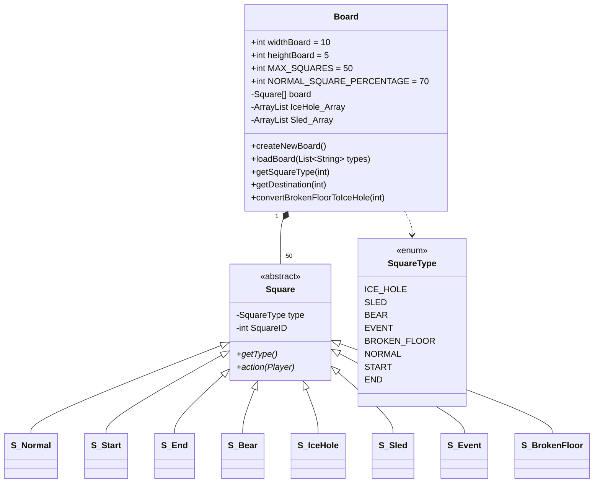

# Paquet `model.board`

Conté la representació del tauler i totes les classes de casella. Subpaquet `.squares` per les implementacions concretes de cada tipus.

## Classes principals



## `Board`

Manté un array de 50 caselles i dues llistes auxiliars:

- **`IceHole_Array`** — índexs ordenats dels forats de gel. Es fa servir a `getDestination()` per buscar el forat anterior.
- **`Sled_Array`** — índexs ordenats dels trineus. Idèntic, però buscant el següent.

### Mètodes destacats

| Mètode | Què fa |
|--------|--------|
| `createNewBoard()` | Genera 50 caselles aleatòries (70% NORMAL, 30% especials). Posa `S_Start` a l'índex 0 i `S_End` a l'últim. |
| `loadBoard(types)` | Reconstrueix el tauler des d'una llista de noms d'enum (per a càrrega de partides desades). |
| `getDestination(idx)` | Per `ICE_HOLE` retorna el forat anterior; per `SLED` el següent trineu; sinó retorna el mateix idx. |
| `convertBrokenFloorToIceHole(idx)` | Quan algú cau a un BROKEN_FLOOR per excés d'objectes, la casella es transforma en un nou ICE_HOLE i s'insereix ordenat a `IceHole_Array`. |
| `dropEdgeIndices(list)` | Defensiu — elimina índexs 0/49 de la llista per evitar que START/END es resolguin com a hole/sled. |

> [!info] Distribució aleatòria
> Per cada cel·la: si `random*100 + 1 <= 70` → NORMAL; sinó es tria 1-5 amb pesos iguals entre ICE_HOLE, SLED, BEAR, EVENT, BROKEN_FLOOR.

## `Square` (abstracta)

Camps: `type: SquareType`, `SquareID: int`. Mètode abstracte:

```java
public abstract String action(Player player);
```

Algunes subclasses retornen `null` per indicar **"resolució delegada al BoardManager"** (forat de gel, trineu, esdeveniment).

## `SquareType` (enum)

Vegeu la taula completa a [[Caselles Especials]].

## Subclasses `S_*`

| Classe | Efecte de `action(player)` |
|--------|----------------------------|
| **`S_Normal`** | Només produeix missatge ("X landed on a normal square") |
| **`S_Start`** | Missatge ("X is at the start") |
| **`S_End`** | Missatge de victòria amb 🎉 |
| **`S_Bear`** | Si té peix: `useObject(FISH, 1)` i missatge "bribed". Sinó: `player.setSquare(0)` i missatge "attacked". |
| **`S_IceHole`** | Retorna `null` — gestionat per `BoardManager.handleIceHole` |
| **`S_Sled`** | Retorna `null` — gestionat per `BoardManager.handleSled` |
| **`S_Event`** | Retorna `null` — gestionat per `BoardManager.handleEvent` |
| **`S_BrokenFloor`** | Branca en 3 segons `getTotalItemCount()`: >5 → start, 1-5 → 50% perdre item / 50% perdre torn, 0 → res |

> [!warning] Per què `S_Event.action` és buit?
> Una versió antiga incloïa un randomitzador 1-of-6 que duplicava la lògica de l'`EventManager` (amb probabilitats incorrectes). Ara la resolució viu **només** a `EventManager.triggerEvent()` per garantir les probabilitats correctes (30/20/15/12/10/8/5).

## `EventManager`

Subsistema d'esdeveniments aleatoris per caselles `EVENT`. Veure [[Caselles Especials#EVENT]] per a probabilitats.

### Enum intern `EventType`

| Constant | Missatge anglès |
|----------|-----------------|
| `GET_FISH` | "🐟 You found a fish!" |
| `GET_SNOWBALLS` | "⛄ You found snowballs!" |
| `GET_FAST_DICE` | "🎲✨ You found a FAST die!" |
| `GET_SLOW_DICE` | "🎲 You found a slow die" |
| `LOSE_TURN` | "❄️ You slipped on ice!" |
| `LOSE_ITEM` | "💨 A gust of wind blew away one of your items!" |
| `SNOWMOBILE` | "🏂 You found a snowmobile!" |

### Classe interna `EventResult`

DTO amb camps: `type`, `message`, `detail`, `newPosition` (-1 si la posició no canvia).

```java
public static EventResult triggerEvent(Player player, Board board) {
    int roll = random.nextInt(100);
    if (roll < 30)      return handleGetSlowDice(player);
    else if (roll < 50) return handleGetSnowballs(player);
    // ...
}
```

## Enllaços relacionats

- [[Caselles Especials]] — vista d'usuari
- [[Paquet model.game]] — `BoardManager` orquestra els handlers
- [[Paquet model.entity]] — `Player` rep els efectes
- [[Diagrama de Classes]] — UML global
