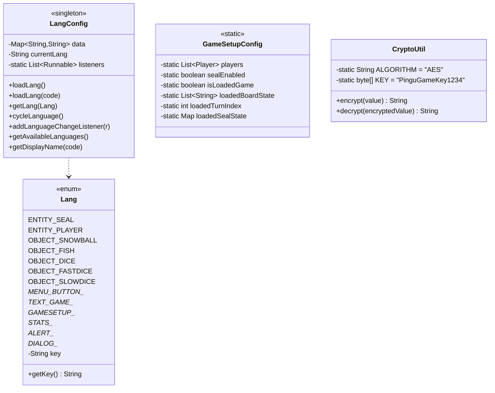

# Paquet `model.config`

Conté 4 classes amb responsabilitats transversals: localització (`Lang`/`LangConfig`), bag de setup (`GameSetupConfig`) i criptografia (`CryptoUtil`).

## Classes



## `Lang` (enum)

Mapeja constants Java a claus YAML. Agrupat per àrea:

```java
ENTITY_SEAL("entity.seal"),
OBJECT_SNOWBALL("object.snowball"),
MENU_BUTTON_NEWGAME("menu.button.newgame"),
ALERT_WRONGPASSWORD_TITLE("alert.wrongpassword.title"),
DIALOG_SELECTPLAYER_HEADER("dialog.selectplayer.header");
```

Avantatge: typos al codi es detecten en compilació en lloc de retornar `null` en temps d'execució.

## `LangConfig` (singleton)

Carrega un YAML i exposa una API per consultar traduccions.

### Estructura interna

| Camp | Tipus | Significat |
|------|-------|-----------|
| `LANG_DIR` | `String` | `/assets/lang/` |
| `DEFAULT_LANG` | `String` | `"en"` |
| `AVAILABLE_LANGUAGES` | `String[]` | `{en, es, ca, fr, pt, ro, ar, ru, uk, ff, jp}` |
| `LANGUAGE_DISPLAY_NAMES` | `LinkedHashMap` | "🌍 English", "🌍 Català", ... |
| `data` | `Map<String,String>` | Diccionari clau→traducció (carregat de YAML) |
| `listeners` | `List<Runnable>` | Callbacks dels controllers per refrescar UI |

### API principal

```java
LangConfig.loadLang();             // carrega "en.yml"
LangConfig.loadLang("ca");         // canvi d'idioma
String t = LangConfig.getLang(Lang.MENU_BUTTON_NEWGAME);
LangConfig.addLanguageChangeListener(this::refreshTexts);
String next = LangConfig.cycleLanguage();  // rotació al següent codi
```

Veure [[Sistema d'Idiomes]] per a la implementació detallada del patró listener.

### Fallback

Si el fitxer demanat no existeix, intenta carregar `en.yml`. Si tampoc existeix, deixa la UI sense traduir però **no llança excepció** — el `getLang()` retorna la pròpia clau (e.g. `"menu.button.newgame"`) per fer els errors visibles.

## `GameSetupConfig` (bag estàtic)

Hand-off entre controllers. **Tots els camps són `static`**.

### Camps

| Camp | Quan s'escriu | Qui ho llegeix |
|------|---------------|----------------|
| `players` | `PlayerSetupController.handleStartGame()` o `SaveLoadService.loadGame()` | `GameBoardController.initializePlayers()` |
| `sealEnabled` | `PlayerSetupController` | `GameBoardController` |
| `isLoadedGame` | `MainMenuController` / setup controllers | `GameBoardController.initialize()` |
| `loadedBoardState` | `SaveLoadService.loadGame()` | `GameBoardController` (rehidrata Board) |
| `loadedTurnIndex` | `SaveLoadService.loadGame()` | `GameBoardController` (rehidrata TurnController) |
| `loadedSealState` | `SaveLoadService.loadGame()` | `GameBoardController` (rehidrata Seal) |

> [!warning] Estat global mutable
> És un anti-pattern en general (testejabilitat), però aquí funciona perquè els JavaFX controllers no es poden construir manualment. Per a una refactor més neta caldria usar `FXMLLoader.setControllerFactory()`.

## `CryptoUtil`

Wrapper sobre **AES-128 amb una clau hardcoded de 16 bytes**.

```java
private static final String ALGORITHM = "AES";
private static final byte[] KEY = "PinguGameKey1234".getBytes();  // 16 bytes
```

### `encrypt(value)`

1. Crea `SecretKeySpec` amb la clau.
2. `Cipher.getInstance("AES")` → mode/padding per defecte de JCE (típicament `AES/ECB/PKCS5Padding`).
3. `cipher.doFinal(value.getBytes("UTF-8"))` → bytes encriptats.
4. Retorna `Base64.encodeToString(...)`.

### `decrypt(encryptedValue)`

Inverteix: Base64 decode → AES decrypt → UTF-8 string.

> [!warning] Limitacions de seguretat
> - **ECB sense IV**: dos textos iguals produeixen el mateix ciphertext (vulnerable a anàlisi de patrons).
> - **Clau hardcoded**: qualsevol decompilador la pot extreure.
> - **No autenticat**: no protegeix contra manipulació.
> 
> Suficient per ofuscar contrasenyes en un projecte didàctic local. **No** apte per a producció.

### Usos al codi

- Encriptar contrasenyes a `SaveLoadService.registerPlayer()` abans d'inserir-les a `ENTITY.PLAYERPASSWORD`.
- Verificar contrasenyes a `SaveLoadService.verifyPassword()`.
- Encriptar el blob YAML complet a `SaveLoadService.saveGame()` (camp `SAVED_GAMES.GAME_DATA`).

## Enllaços relacionats

- [[Sistema d'Idiomes]] · [[Sistema de Persistència]]
- [[Idiomes i Localització]] — vista d'usuari
- [[Paquet model.game]] — `SaveLoadService` usa `CryptoUtil`
- [[Paquet controller]] — controllers que registren listeners
