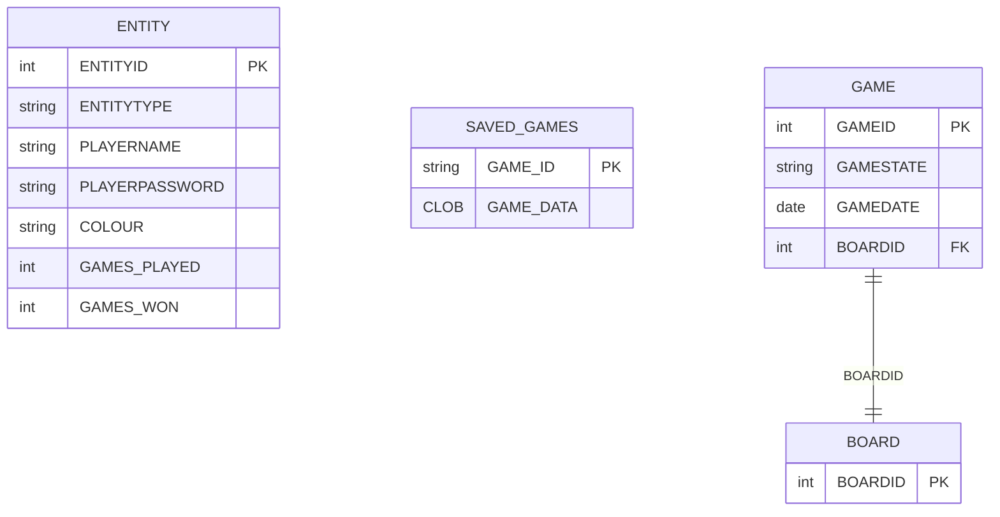
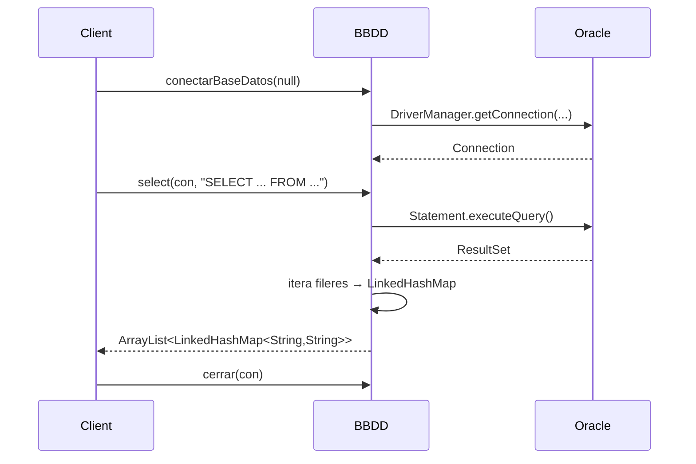

# Paquet `model.db`

Conté **`BBDD.java`**, la classe d'utilitat per connectar amb la base de dades Oracle del curs. És una plantilla proporcionada pels professors d'Ilerna (els comentaris originals són en castellà).

> [!info] Codi del curs
> Bona part del codi conserva l'estil i els comentaris originals del professor — no s'ha refactoritzat per mantenir la coherència amb la resta de pràctiques de l'aula.

## Connexió

```java
public static Connection conectarBaseDatos(Scanner scan) {
    String entorno = "fuera"; // o "centro"
    String url = entorno.equals("centro")
        ? "jdbc:oracle:thin:@//192.168.3.26:1521/XEPDB2"
        : "jdbc:oracle:thin:@//oracle.ilerna.com:1521/XEPDB2";

    String user = "DW2526_GR06_PINGU";
    String pwd  = "ABDJFMV";

    Class.forName("oracle.jdbc.driver.OracleDriver");
    Connection con = DriverManager.getConnection(url, user, pwd);
    return con;
}
```

> [!warning] Credencials hardcoded
> L'usuari i la contrasenya estan al codi font. Per a un projecte didàctic és acceptable; **no** ho seria a producció.

## Mètodes oferts

| Mètode | Tipus | Què fa |
|--------|-------|--------|
| `conectarBaseDatos(scan)` | static | Estableix la connexió i la retorna |
| `cerrar(con)` | static | Tanca la connexió ignorant excepcions |
| `insert(con, sql)` | static | INSERT (retorna files afectades) |
| `update(con, sql)` | static | UPDATE |
| `delete(con, sql)` | static | DELETE |
| `select(con, sql)` | static | SELECT → `ArrayList<LinkedHashMap<String,String>>` (columnes → valors) |
| `print(con, sql, cols)` | static | SELECT debug (imprimeix per consola) |
| `executeInsUpDel(con, sql, label)` | static | Wrapper comú per a INSERT/UPDATE/DELETE |

A més, dos mètodes d'instància/static llegacy:
- `registrarJugadorEnBD(...)` — inserta a `ENTITY` directament (no encripta). Substituït per `SaveLoadService.registerPlayer`.
- `guardarPartida(listaJugadores)` — versió antiga del save (Base64, no AES). Substituïda per `SaveLoadService.saveGame`.

## Esquema esperat a Oracle



> [!warning] Esquema gestionat pel curs
> El DDL no està al projecte (es proporciona a l'aula). Aquesta documentació l'**infereix** dels usos a `SaveLoadService`.

## Operacions típiques



## `BBDDPanel` (test manual)

A `view.ui` hi ha **`BBDDPanel.java`** amb un `main()` que prova INSERT/UPDATE/DELETE manual sobre la taula `ENTITY`. No forma part del flux del joc, és només un test d'integració utilitzable des d'Eclipse.

## Consideracions

| Problema | Per què ho fa | Què caldria a producció |
|----------|---------------|--------------------------|
| Concatenació SQL | Codi de curs senzill | `PreparedStatement` per a tot |
| `.replace("'", "''")` | Mitigació mínima d'injection | Bind parameters |
| Credencials hardcoded | Pràctica didàctica | Variables d'entorn o vault |
| Sense pooling | No cal a un joc local | HikariCP / connection pool |

## Enllaços relacionats

- [[Sistema de Persistència]] — fluxos complets
- [[Paquet model.game]] — `SaveLoadService` és qui crida `BBDD.*`
- [[Guardar i Carregar]] — vista d'usuari
