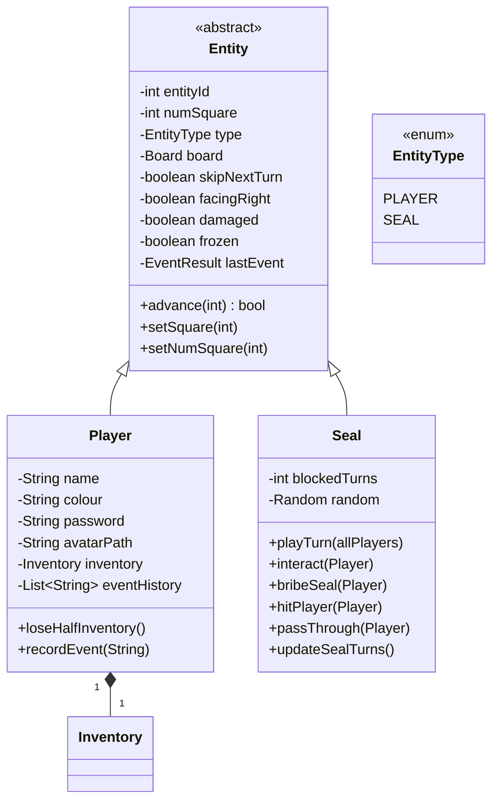
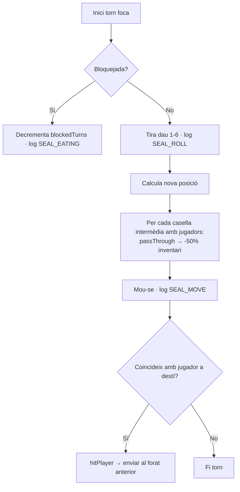

# Paquet `model.entity`

Conté les entitats que es mouen pel tauler: el **`Player`** (humà) i la **`Seal`** (CPU opcional), amb una superclasse comuna `Entity`.

## Classes



## `Entity` (abstracta)

Comporta tot l'estat genèric:

| Camp | Tipus | Significat |
|------|-------|-----------|
| `entityId` | int | ID aleatori (no UUID) |
| `numSquare` | int | Índex actual al tauler (0..49) |
| `type` | `EntityType` | PLAYER o SEAL |
| `board` | `Board` | Referència al tauler (transient) |
| `skipNextTurn` | boolean | Marca si ha de perdre el següent torn |
| `facingRight` | boolean | Estat visual transient |
| `damaged` | boolean | Mostra sprite de dany (flash) |
| `frozen` | boolean | Mostra sprite congelat |
| `lastEvent` | `EventResult` | Últim event que ha tocat (per UI) |

### Mètodes importants

- **`advance(steps)`**: avança N caselles. Retorna `true` si ha arribat al final. Actualitza `facingRight` segons direcció.
- **`setSquare(newPosition)`**: clampa a `[0, MAX_SQUARES-1]` i actualitza `facingRight`.
- **`setNumSquare(int)`**: igual però sense clampar manualment.

## `Player`

Subclasse principal. Constructors:

```java
public Player(String name, String colour);
public Player(String name, String colour, String password);
```

Camps específics:
- **`name`**, **`colour`** (hex de 6 dígits), **`password`** (sense encriptar en memòria).
- **`avatarPath`**: URI a una imatge personalitzada (opcional).
- **`inventory`**: instància d'[[Paquet model.item|Inventory]].
- **`eventHistory`**: `List<String>` capada a **`MAX_EVENT_HISTORY = 50`** entrades.

### Mètodes específics

- **`recordEvent(msg)`**: afegeix al log personal i descarta les més antigues si supera 50.
- **`loseHalfInventory()`**: delega a `inventory.removeHalf()`. Es crida quan la foca passa per sobre del jugador.

## `Seal` (CPU)

Una sola foca per partida. Estat:
- **`blockedTurns`** — quants torns està menjant un peix.
- **`random`** — generador d'aleatoris per la seva tirada.

### Comportament durant `playTurn(allPlayers)`



### Mètodes destacats

| Mètode | Què fa |
|--------|--------|
| **`interact(player)`** | Quan un jugador cau a la casella de la foca. Si bloquejada → safe. Si té peix → `bribeSeal`. Sinó → `hitPlayer`. |
| **`bribeSeal(player)`** | Gasta 1 peix → bloqueja 2 torns la foca |
| **`hitPlayer(player)`** | Envia el jugador al forat de gel anterior (o casella 0) |
| **`passThrough(player)`** | Crida `player.loseHalfInventory()` |
| **`updateSealTurns()`** | Decrementa `blockedTurns`; al arribar a 0 emet `SEAL_ACTIVE` |
| **`playTurn(allPlayers)`** | Bucle complet: tira, mou, processa col·lisions |
| **`findPreviousIceHole(pos)`** | Recorre `board.getIceHole_Array()` per trobar el forat anterior |

> [!warning] Victòria de la foca
> Si la foca arriba a `Board.MAX_SQUARES - 1` (índex 49), TOTS els jugadors humans perden. Es marca a `GameBoardController.playSealTurnAnimated()` amb `gameOver = true` i `winner = "Seal"`.

## `EntityType` (enum)

```java
public enum EntityType { PLAYER, SEAL }
```

Es fa servir per diferenciar entitats sense fer `instanceof` repetidament al codi de joc.

## Enllaços relacionats

- [[Paquet model.board]] — taula on es mouen
- [[Paquet model.item]] — inventari del jugador
- [[Paquet model.game]] — `ActionResult` reporta efectes de la foca
- [[Sistema de Sprites]] — com es dibuixen `damaged`/`frozen`/`facingRight`
