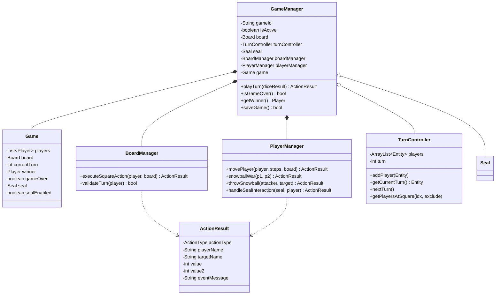
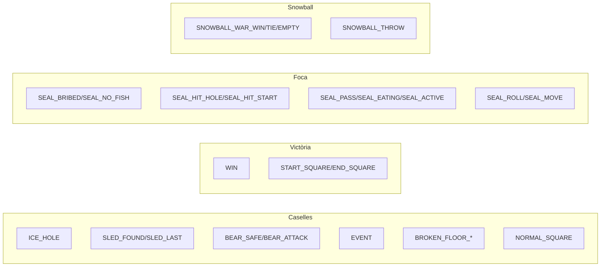

# Paquet `model.game`

Aquest paquet conté el **motor del joc** (coordinadors + estat agregat) i el servei de persistència. És el "cervell" que orquestra el moviment de jugadors i la resolució de caselles.

## Visió general



## `Game`

POJO d'estat agregat (DTO mutable). Té setters/getters per a tot:

| Camp | Tipus |
|------|-------|
| `players` | `List<Player>` |
| `board` | `Board` |
| `currentTurn` | int |
| `winner` | `Player` (`null` mentre la partida està en curs) |
| `gameOver` | boolean |
| `seal` | `Seal` (opcional) |
| `sealEnabled` | boolean |

> [!info] Per què POJO sense lògica?
> SnakeYAML pot serialitzar directament aquesta classe, i els coordinadors la modifiquen com un *bag*. Tota la lògica viu a les classes `*Manager`.

## `GameManager`

Punt central. Mètode clau:

```java
public ActionResult playTurn(int diceResult) {
    Player current = getCurrentPlayer();
    ActionResult moveMsg = playerManager.movePlayer(current, diceResult, board);
    if (moveMsg != null) {                  // jugador ha arribat al final
        game.setGameOver(true);
        game.setWinner(current);
        return moveMsg;
    }
    return boardManager.executeSquareAction(current, board);
}
```

> [!warning] Construcció dispersa
> Al constructor només es crea `boardManager`, `playerManager` i `game`. El `Board`, `TurnController` i `Seal` s'**injecten** via setters des de `GameBoardController.initialize()`.

## `BoardManager`

Resol l'efecte d'aterrar a una casella concreta. El mètode `executeSquareAction(player, board)` fa un *switch* sobre `SquareType`:

| Tipus | Mètode privat | Resultat |
|-------|---------------|----------|
| `ICE_HOLE` | `handleIceHole` | mou al forat anterior |
| `SLED` | `handleSled` | mou al següent trineu |
| `BEAR` | `handleBear` | gasta peix o torna a 0 |
| `EVENT` | `handleEvent` | crida [[Paquet model.board\|EventManager.triggerEvent]] |
| `BROKEN_FLOOR` | `handleBrokenFloor` | 3 branques segons items totals |
| Altres | inline | retorna `ActionResult` simple |

També té `validateTurn(player)` que consumeix el flag `skipNextTurn`.

## `PlayerManager`

Maneja moviment i interaccions entre jugadors.

| Mètode | Què fa |
|--------|--------|
| **`movePlayer(p, steps, board)`** | Avança steps caselles. Retorna `ActionResult` `WIN` si arriba al final, sinó `null`. |
| **`snowballWar(p1, p2)`** | Tots dos gasten totes les boles → qui té més guanya → l'altre retrocedeix per la diferència. Empat: ningú es mou. |
| **`throwSnowball(attacker, target)`** | Atacant gasta 1 bola → objectiu retrocedeix 1-3 caselles aleatori. |
| **`handleSealInteraction(seal, p)`** | Delega a `seal.interact(p)`. |

## `TurnController`

Round-robin amb `ArrayList<Entity>`. Mètodes:

| Mètode | Comentari |
|--------|-----------|
| `addPlayer(Entity)` | Afegeix a la cua (humà o foca) |
| `getCurrentTurn()` | `players.get(turn)` |
| `nextTurn()` | `turn = (turn+1) % size`. Si el següent té `shouldSkipNextTurn()==true`, consumeix el flag i salta un altre |
| `getHumanPlayers()` | Filtra només els `Player` (sense la foca) |
| `getPlayersAtSquare(idx, excl)` | Per detectar col·lisions snowball war |

## `ActionResult` (DTO)

DTO que viatja del motor a la UI. Té un `ActionType` enum amb 25+ variants i camps genèrics:

- `playerName` / `targetName`
- `value` / `value2` (per dades numèriques: índex destinació, dau, comptadors)
- `eventMessage` (per text custom d'events)

### `ActionType` agrupat



[[Paquet controller|GameBoardController.formatActionMessage]] tradueix `ActionType` a una cadena humana per al log.

## `SaveLoadService`

Servei estàtic de persistència contra Oracle.

### Mètodes públics

| Mètode | Funció |
|--------|--------|
| `saveGame(name, board, tc, seal, winner)` | Serialitza a YAML, encripta amb [[Paquet model.config\|CryptoUtil]], INSERT a `SAVED_GAMES` (CLOB) |
| `loadGame(gameId)` | SELECT, desencripta, parseja YAML, omple [[Paquet model.config\|GameSetupConfig]] |
| `getAllSavedGameIds()` | Per al `ChoiceDialog` de carregar |
| `recordGameResult(allPlayers, winnerName)` | INSERT a `GAME` + UPDATE counters a `ENTITY` |
| `registerPlayer(name, pwd, color)` | MERGE a `ENTITY` (insert/update) amb contrasenya encriptada |
| `verifyPassword(name, input)` | Compara contrasenya escrita contra el valor desencriptat de BBDD |
| `getPlayerStats()` | SELECT per a la pantalla d'estadístiques |
| `getRegisteredPlayers()` | SELECT per al *picker* "seleccionar jugador existent" |

Detalls a [[Sistema de Persistència]].

## `SoundManager` (singleton)

Gestiona música i SFX. Veure [[Sistema de So]] per a detalls.

## Enllaços relacionats

- [[Arquitectura General]] — visió MVC
- [[Paquet model.board]] · [[Paquet model.entity]] · [[Paquet model.item]]
- [[Paquet controller]] — qui crida tot això
- [[Sistema de Persistència]] · [[Sistema de So]]
- [[Flux de Joc]] — diagrames de seqüència
