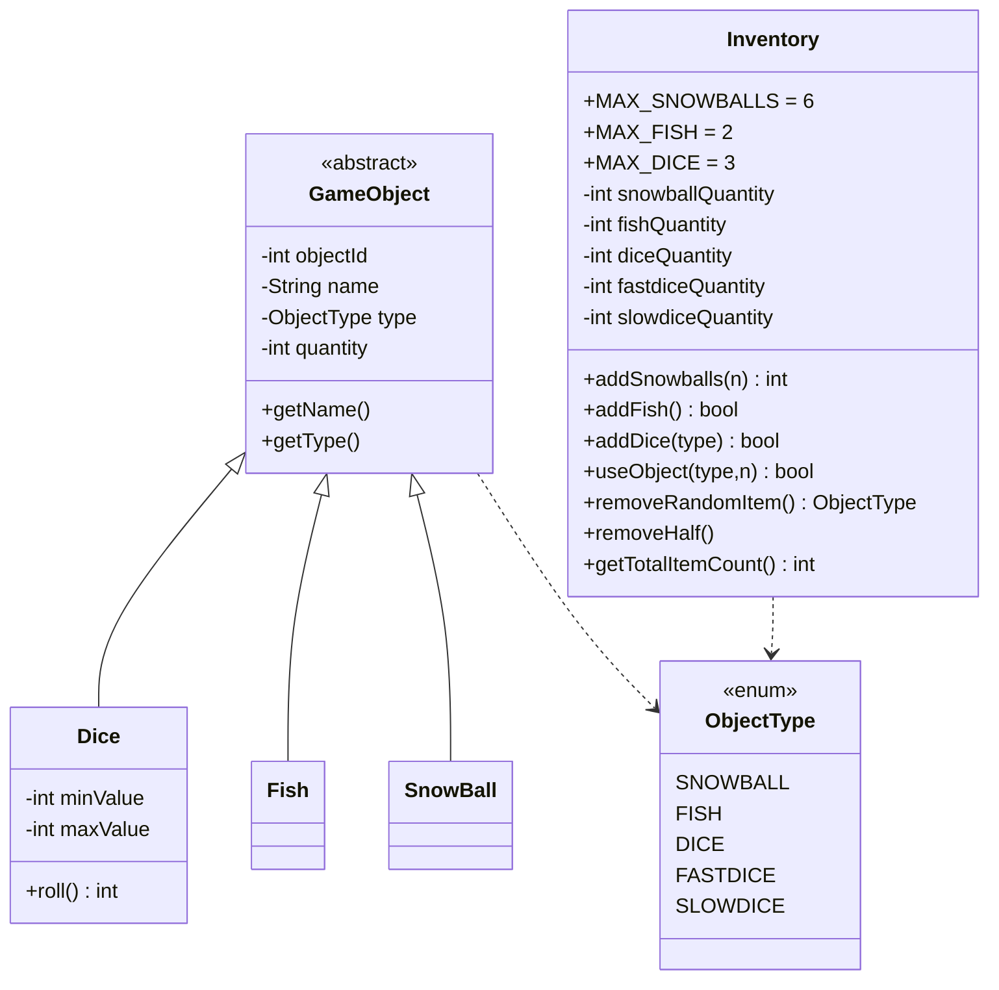

# Paquet `model.item`

Modela els objectes de l'inventari (peixos, boles, daus) i la classe **`Inventory`** que els emmagatzema. Subpaquet `.objects` per a les implementacions concretes.

## Diagrama de classes



## `GameObject` (abstracta)

Plantilla mínima per tot objecte. Camps:
- `objectId`: ID aleatori (només per logs).
- `name`: etiqueta humana.
- `type`: `ObjectType`.
- `quantity`: poc usat — la majoria de comptadors viuen a `Inventory`.

Constructor: assigna un id aleatori amb `Math.random()*100000`.

## `ObjectType` (enum)

| Constant | Significat |
|----------|-----------|
| `SNOWBALL` | Bola de neu (ofensiva) |
| `FISH` | Peix (subornar ós o foca) |
| `DICE` | Marker genèric / comptador total de daus |
| `FASTDICE` | Dau de 5-10 |
| `SLOWDICE` | Dau d'1-3 |

> [!info] `DICE` és un sumatori
> Es manté com a sub-tipus per comoditat (`diceQuantity = fastdiceQuantity + slowdiceQuantity`), però mai s'instancia un objecte `Dice` amb tipus `DICE` a la partida — només FASTDICE i SLOWDICE acaben a l'inventari.

## `Dice`

```java
public Dice(ObjectType diceType) {
    super(diceType);
    switch (diceType) {
        case FASTDICE:
            this.setName("Fast Dice");
            this.minValue = 5;  this.maxValue = 10;
            break;
        case SLOWDICE:
            this.setName("Slow Dice");
            this.minValue = 1;  this.maxValue = 3;
            break;
        default:
            this.setName("Dice");
            this.minValue = 1;  this.maxValue = 6;
    }
}

public int roll() {
    return (int) ((Math.random() * (maxValue - minValue + 1)) + minValue);
}
```

[[Tauler de Joc|GameBoardController]] crea **tres instàncies** de `Dice` (default, fast, slow) i les reutilitza a totes les tirades.

## `Fish` i `SnowBall`

Subclasses trivials que només estableixen el nom i el tipus al constructor:

```java
public Fish()    { super(ObjectType.FISH);    setName("Fish"); }
public SnowBall(){ super(ObjectType.SNOWBALL);setName("Snowball"); }
```

> [!warning] No s'instancien gairebé mai
> Tot i existir, aquestes classes pràcticament no es creen com a objectes durant el joc — `Inventory` només manté **comptadors** entera. Existeixen per coherència amb el patró GameObject (per si calgués estendre el sistema d'objectes).

## `Inventory`

És el cor del sistema d'objectes. Estat:

| Camp | Màxim | Comentari |
|------|-------|-----------|
| `snowballQuantity` | **6** (`MAX_SNOWBALLS`) | |
| `fishQuantity` | **2** (`MAX_FISH`) | |
| `diceQuantity` | **3** (`MAX_DICE`) | Suma de fastdice + slowdice |
| `fastdiceQuantity` | — | Part de diceQuantity |
| `slowdiceQuantity` | — | Part de diceQuantity |

### API resumida

```java
int  addSnowballs(int count);           // afegeix fins a cap
boolean addFish();                       // true si afegit
boolean addDice(ObjectType diceType);    // FASTDICE o SLOWDICE
int  getObjectQuantity(ObjectType o);
boolean useObject(ObjectType o, int n);  // false si no hi ha prou
ObjectType removeRandomItem();           // null si buit
void removeHalf();                       // foca passant per sobre
int  getTotalItemCount();                // snowball + fish + fast + slow
```

> [!tip] `removeHalf()`
> Divideix per 2 (enter) cada comptador. `diceQuantity` es recalcula com `fastdiceQuantity + slowdiceQuantity` per evitar inconsistències.

### Casos d'ús al joc

- **Casella BEAR**: `inv.useObject(FISH, 1)` si en té; sinó `setSquare(0)`.
- **Casella EVENT GET_X**: `inv.addSnowballs(n)`, `inv.addFish()`, `inv.addDice(type)`.
- **Casella EVENT LOSE_ITEM**: `inv.removeRandomItem()`.
- **Casella BROKEN_FLOOR > 5 items**: `setSquare(0)` (sense tocar inventari).
- **Foca passant**: `inv.removeHalf()`.
- **Snowball war**: `useObject(SNOWBALL, balls)` per a tots dos.

## Enllaços relacionats

- [[Inventari i Objectes]] — vista d'usuari
- [[Paquet model.entity]] — `Player.inventory`
- [[Caselles Especials]] — quan es modifica
