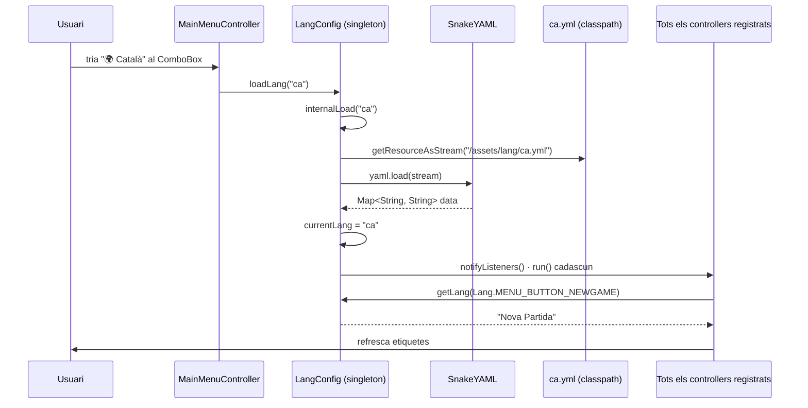

# Sistema d'Idiomes

Localització basada en **YAML** + un singleton (`LangConfig`) + un enum (`Lang`) + el patró **Observer** per a refresc en viu.

## Diagrama



## El fitxer YAML

Format pla **clau:valor**, sense estructura jeràrquica (encara que les claus tinguin punts):

```yaml
text.game.title: "El Joc del Pingüí"
menu.button.newgame: "Nova Partida"
menu.button.loadgame: "Carregar Partida"
gamesetup.player: "Jugador "
alert.wrongpassword.message: "La contrasenya del jugador '%s' és incorrecta..."
```

> [!info] Format pla
> SnakeYAML el carrega com a `Map<String, String>` on les claus mantenen els punts (`"menu.button.newgame"`). No s'utilitza estructura niada per simplicitat.

## L'enum `Lang`

Cada constant Java guarda la seva clau YAML (consultable amb `.getKey()`):

```java
public enum Lang {
    MENU_BUTTON_NEWGAME ("menu.button.newgame"),
    ALERT_WRONGPASSWORD_MESSAGE ("alert.wrongpassword.message"),
    // ... ~40 constants en total
    ;
    private final String key;
    Lang(String key) { this.key = key; }
    public String getKey() { return key; }
}
```

## Lookup

```java
public static String getLang(Lang lang) {
    LangConfig config = getInstance();
    String value = config.data.get(lang.getKey());
    return value != null ? value : lang.getKey();
}
```

> [!tip] Fallback útil
> Si no hi ha traducció, retorna la **clau** (ex. `"menu.button.newgame"`) en lloc de `null`. Fa que els missatges no traduïts siguin visibles a la UI sense crashejar.

## Idiomes disponibles

Definits a l'array `AVAILABLE_LANGUAGES`:

```java
private static final String[] AVAILABLE_LANGUAGES = {
    "en", "es", "ca", "fr", "pt", "ro", "ar", "ru", "uk", "ff", "jp"
};
```

I un `LinkedHashMap` (per preservar l'ordre del dropdown) amb les etiquetes mostrades a l'usuari (veure [[Idiomes i Localització]]).

## Patró Listener

Cada controller que té text traduïble registra un callback al `LangConfig`:

```java
@FXML
public void initialize() {
    LangConfig.addLanguageChangeListener(this::refreshTexts);
    refreshTexts();   // setup inicial
}

private void refreshTexts() {
    titleText.setText(LangConfig.getLang(Lang.TEXT_GAME_TITLE));
    newGame_button.setText(LangConfig.getLang(Lang.MENU_BUTTON_NEWGAME));
    // ...
}
```

I a `LangConfig.loadLang(code)`:

```java
private void internalLoad(String langCode) {
    // ... carrega YAML
    data = yaml.load(inputStream);
    currentLang = langCode;
    notifyListeners();    // tots els controllers refresquen alhora
}

private static void notifyListeners() {
    for (Runnable listener : listeners) listener.run();
}
```

## Quan s'inicialitza

A `MainMenu.main()`:

```java
public static void main(String[] args) {
    LangConfig.loadLang();   // carrega "en.yml" per defecte
    launch(args);
}
```

I `loadLang()` (sense paràmetres) crida `loadLang(DEFAULT_LANG = "en")`.

## Fallback de càrrega

```java
private void internalLoad(String langCode) {
    try (InputStream in = getClass().getResourceAsStream(LANG_DIR + langCode + ".yml")) {
        if (in == null) {
            if (!langCode.equals(DEFAULT_LANG)) {
                internalLoad(DEFAULT_LANG);   // intenta en.yml
            }
        } else {
            data = yaml.load(in);
            currentLang = langCode;
            notifyListeners();
        }
    } catch (Exception e) { e.printStackTrace(); }
}
```

> [!warning] Doble fallback infinit?
> No, perquè el bloc `if (!langCode.equals(DEFAULT_LANG))` només es dispara una vegada. Si tampoc existeix `en.yml`, la UI queda sense traduir però **no entra en bucle**.

## Mètodes auxiliars

| Mètode | Funció |
|--------|--------|
| `getCurrentLang()` | Codi actiu actual (e.g. `"ca"`) |
| `getAvailableLanguages()` | Array de codis |
| `getDisplayName(code)` | "🌍 Català" per `"ca"` |
| `cycleLanguage()` | Rotació al següent idioma (per a un botó simple sense ComboBox) |
| `removeLanguageChangeListener(r)` | Per netejar listeners quan es destrueix una pantalla |

## Comportament en canvi de pantalla

Quan canvies de pantalla els controllers antics encara estan registrats com a listeners (mai es desregistren explícitament al projecte actual). En la pràctica no és problema perquè els seus components ja no estan visibles. Per a una refactorització més neta caldria invocar `removeLanguageChangeListener` als `handleBack`.

## Enllaços relacionats

- [[Idiomes i Localització]] — vista d'usuari
- [[Paquet model.config]] — `Lang` i `LangConfig`
- [[Paquet view]] — fitxers YAML
