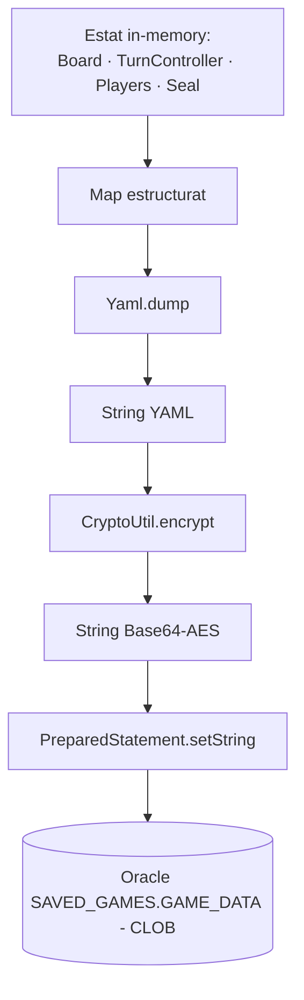
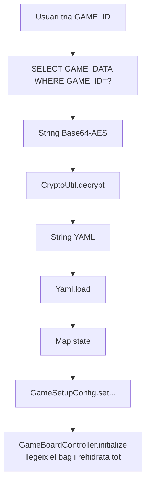

# Sistema de Persistència

Pipeline complet de guardat i càrrega de partides, jugadors i estadístiques. Combina **SnakeYAML** (serialització) + **AES-128 / Base64** (encriptació) + **Oracle JDBC** (storage).

## Flux de guardat



## Mètode `SaveLoadService.saveGame(...)`

Construeix un `Map<String, Object>` amb la informació següent:

```java
Map<String, Object> state = new HashMap<>();
state.put("board", List<String>);             // SquareType.name() per cada casella
state.put("currentTurn", int);
state.put("players", List<Map>);              // veure sota
state.put("seal", Map);                       // opcional (square, blockedTurns)
```

Cada jugador es mapeja com:

```java
{
  name: "Pingu",
  color: "FF0000",
  password: "xxx",        // clar a YAML; serà encriptat dins el CLOB global
  id: 12345,
  square: 17,
  skipNextTurn: false,
  inventory: { snowballs: 3, fish: 1, fastdice: 0, slowdice: 1 },
  eventHistory: [ "...", "..." ]
}
```

Després serialitza, encripta i insereix amb `PreparedStatement`:

```java
String sql = "INSERT INTO SAVED_GAMES (GAME_ID, GAME_DATA) VALUES (?, ?)";
try (PreparedStatement ps = con.prepareStatement(sql)) {
    ps.setString(1, customName);
    ps.setString(2, encrypted);
    int rows = ps.executeUpdate();
    if (!con.getAutoCommit()) con.commit();
}
```

> [!warning] Per què `PreparedStatement` (i no concatenació)?
> La columna `GAME_DATA` és **CLOB** i l'YAML encriptat fàcilment supera els **4000 caràcters**, el límit dels literals SQL d'Oracle (`ORA-01704: string literal too long`). El `PreparedStatement` envia el valor en streaming via JDBC i evita el problema.

## Flux de càrrega



`SaveLoadService.loadGame(gameId)` retorna `true/false` i deixa la informació a [[Paquet model.config|GameSetupConfig]]:

```java
GameSetupConfig.setLoadedBoardState((List<String>) state.get("board"));
GameSetupConfig.setLoadedTurnIndex(((Number) state.get("currentTurn")).intValue());
GameSetupConfig.setPlayers(reconstructedPlayers);
if (state.containsKey("seal")) {
    GameSetupConfig.setSealEnabled(true);
    GameSetupConfig.setLoadedSealState((Map) state.get("seal"));
}
GameSetupConfig.setLoadedGame(true);
```

I `GameBoardController.initialize()` detecta `isLoadedGame()` i fa `gameBoard.loadBoard(...)` en lloc de `createNewBoard()`.

## Encriptació amb `CryptoUtil`

```java
private static final String ALGORITHM = "AES";
private static final byte[] KEY = "PinguGameKey1234".getBytes();   // 16 bytes

public static String encrypt(String value) {
    SecretKeySpec sk = new SecretKeySpec(KEY, ALGORITHM);
    Cipher cipher = Cipher.getInstance(ALGORITHM);
    cipher.init(Cipher.ENCRYPT_MODE, sk);
    byte[] enc = cipher.doFinal(value.getBytes("UTF-8"));
    return Base64.getEncoder().encodeToString(enc);
}
```

> [!warning] AES/ECB sense IV
> `Cipher.getInstance("AES")` resol per defecte a `AES/ECB/PKCS5Padding` al JCE estàndard. Sense IV i sense MAC, el sistema **no és apte per a producció**. Per al projecte didàctic és suficient per ofuscar contrasenyes contra inspecció casual.

## Registre de jugador

`SaveLoadService.registerPlayer(name, password, color)` usa una sentència **MERGE** d'Oracle per fer un *upsert* atòmic:

```sql
MERGE INTO ENTITY e
USING (SELECT 'Pingu' AS pname FROM DUAL) src
ON (e.PLAYERNAME = src.pname AND e.ENTITYTYPE = 'PLAYER')
WHEN MATCHED THEN
  UPDATE SET e.PLAYERPASSWORD = '<encrypted>', e.COLOUR = '<hex>'
WHEN NOT MATCHED THEN
  INSERT (ENTITYID, ENTITYTYPE, PLAYERNAME, PLAYERPASSWORD, COLOUR, GAMES_PLAYED, GAMES_WON)
  VALUES (<newId>, 'PLAYER', '<name>', '<encrypted>', '<hex>', 0, 0)
```

> [!info] Generació d'ENTITYID
> En no usar SEQUENCE/IDENTITY, l'ID es deriva amb `SELECT NVL(MAX(ENTITYID), 0) + 1 FROM ENTITY`. Pot tenir condicions de carrera amb concurrència alta — acceptable per ús local.

## Verificació de contrasenya

```java
public static boolean verifyPassword(String playerName, String inputPassword) {
    String stored = SELECT PLAYERPASSWORD FROM ENTITY WHERE PLAYERNAME = ...
    if (stored == null || stored.isEmpty()) {
        return (inputPassword == null || inputPassword.isEmpty());
    }
    String decrypted = CryptoUtil.decrypt(stored);
    return inputPassword.equals(decrypted);
}
```

Si el jugador **no existeix** a la BBDD encara, retorna `true` (es considera una alta nova).

## Estadístiques de partida

`recordGameResult(allPlayers, winnerName)`:

1. Crea una fila a `BOARD` (id=1) si no existeix.
2. INSERT a `GAME (GAMESTATE='FINISHED', GAMEDATE=SYSDATE, BOARDID=1)`.
3. Per cada jugador: `UPDATE ENTITY SET GAMES_PLAYED = NVL(GAMES_PLAYED, 0) + 1 WHERE PLAYERNAME='...'`.
4. Si hi ha guanyador: `UPDATE ENTITY SET GAMES_WON = NVL(GAMES_WON, 0) + 1 WHERE PLAYERNAME='<winner>'`.

> [!tip] Per què `NVL`?
> A Oracle, `NULL + 1 = NULL`. Sense `NVL(col, 0)` les columnes podrien quedar a NULL eternament. `NVL` substitueix NULL per 0 abans de sumar.

## Estructura de fitxer YAML d'exemple

```yaml
board:
- START
- NORMAL
- BEAR
- NORMAL
- ICE_HOLE
- ...   # 50 valors total acabant amb END
currentTurn: 1
players:
- name: Pingu
  color: FF0000
  password: hunter2
  id: 12345
  square: 17
  skipNextTurn: false
  inventory:
    snowballs: 3
    fish: 1
    fastdice: 0
    slowdice: 1
  eventHistory:
  - "🎲4 (Normal) → ⛄ ..."
seal:
  square: 22
  blockedTurns: 0
```

Tot això s'encripta abans de pujar-se a `SAVED_GAMES.GAME_DATA`.

## Enllaços relacionats

- [[Guardar i Carregar]] — vista d'usuari
- [[Paquet model.game]] — codi de `SaveLoadService`
- [[Paquet model.db]] — capa Oracle (BBDD)
- [[Paquet model.config]] — `CryptoUtil` i `GameSetupConfig`
