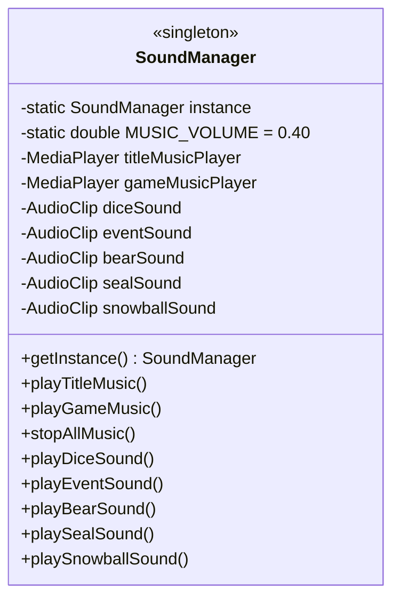
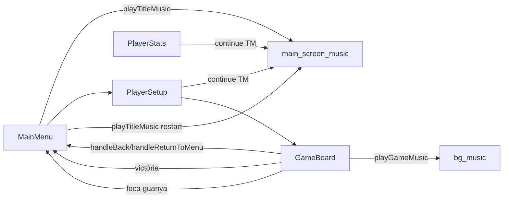

# Sistema de So

Centralitzat al singleton **`SoundManager`** ([[Paquet model.game]]). Necessita el mòdul `javafx.media`.

## Arquitectura



## Recursos d'àudio

| Fitxer | Tipus | Quan sona |
|--------|-------|-----------|
| `main_screen_music.wav` | Música (loop) | Menú principal, configuració, estadístiques |
| `bg_music.wav` | Música (loop) | Pantalla de joc |
| `dice.wav` | SFX | Quan acaba l'animació de tirada (1.5s després del clic) |
| `event.wav` | SFX | Quan es trepitja una casella EVENT |
| `bear.wav` | SFX | Quan ataca l'ós |
| `seal.wav` | SFX | Torn de la foca o trobada amb la foca |
| `snowball.wav` | SFX | En llançar una bola de neu o en guerra |

Tots viuen a `/assets/sounds/`.

## Diferència Media vs AudioClip

- **Música**: `MediaPlayer` (`Media` + `MediaPlayer`) — apte per a pistes llargues amb control de cicle i volum.
- **SFX**: `AudioClip` — baixa latència, ideal per sons curts disparats múltiples vegades.

## Càrrega amb fallback

A l'init, si el fitxer no existeix només es loga però **no es llança excepció**:

```java
private AudioClip loadSound(String path) {
    try {
        URL url = getClass().getResource(path);
        if (url != null) return new AudioClip(url.toExternalForm());
    } catch (Exception e) {
        System.out.println("Could not load sound: " + path);
    }
    return null;
}
```

Després, els *play* són no-ops si el clip és `null`:

```java
public void playDiceSound() { if (diceSound != null) diceSound.play(); }
```

> [!tip] Robustesa
> Si falten fitxers de so, el joc segueix funcionant sense àudio. Útil per a desplegaments parcials.

## Canvi de música

```java
public void playTitleMusic() { switchMusic(titleMusicPlayer, gameMusicPlayer); }
public void playGameMusic()  { switchMusic(gameMusicPlayer,  titleMusicPlayer); }

private void switchMusic(MediaPlayer toPlay, MediaPlayer toStop) {
    if (toStop != null && toStop.getStatus() != Status.STOPPED) toStop.stop();
    if (toPlay != null) {
        toPlay.seek(Duration.ZERO);   // sempre des del principi
        toPlay.play();
    }
}
```

> [!info] Reinici des de zero
> En tornar al menú principal des d'una partida, la música de títol **es reinicia des del començament** (no continua on s'havia parat). Mateixa cosa per a la música de joc en entrar a partida.

## Cicle de música segons pantalla



## Volum global

Constant `MUSIC_VOLUME = 0.40` aplicada a tots els `MediaPlayer`. Els `AudioClip` SFX van al volum natiu (no s'ajusta).

## On es crida cada so

| So | Crida des de | Quan |
|----|--------------|------|
| `playTitleMusic` | `MainMenuController.initialize` · `GameBoardController.handleBack/handleWin/handleReturnToMenu` | Tornar al menú |
| `playGameMusic` | `GameBoardController.initialize` | Començar partida |
| `playDiceSound` | `GameBoardController.processDiceRoll` (amb delay 1.5s) | Tirada del dau |
| `playEventSound` | `GameBoardController.runDiceMovement` (cas EVENT) | Casella EVENT |
| `playBearSound` | `GameBoardController.runDiceMovement` (cas BEAR_ATTACK) | Ós ataca |
| `playSealSound` | `GameBoardController` (turn foca / col·lisió) | Torn de la foca |
| `playSnowballSound` | `GameBoardController` (war / throw) | Llançar bola |

## Enllaços relacionats

- [[Paquet model.game]] — codi de `SoundManager`
- [[Paquet controller]] — qui crida els mètodes
- [[Tauler de Joc]] — pantalla amb música de joc
