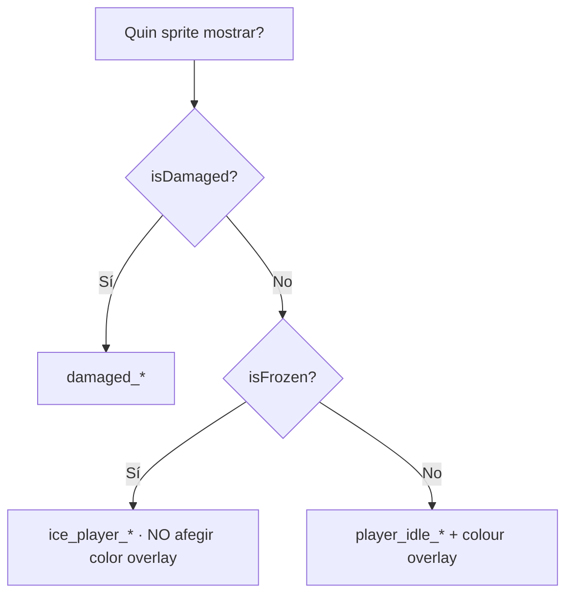

# Sistema de Sprites

El joc utilitza **pixel-art** (sprites de 17×19 píxels per al pingüí) renderitzat a `Canvas` amb *nearest-neighbour* per garantir píxels nítids a qualsevol mida.

## Layering d'una casella

Cada casella és una `StackPane` apilant fins a **4 capes** de Canvas:

```mermaid
flowchart TB
    L0[Capa 0: Background canvas - Square-N.png] --> L1
    L1[Capa 1: Foreground canvas - SQUARETYPE.png] --> L2
    L2[Capa 2: Sprites de jugadors centrats] --> L3
    L3[Capa 3 (opcional): Sprite de la foca]
```

Codi rellevant a `GameBoardController.createCell()`:

```java
Image cellBackground = loadImage(getBackgroundImagePath(squareIndex));
if (cellBackground != null) {
    Canvas bgCanvas = new Canvas(cellSize, cellSize);
    bgCanvas.getGraphicsContext2D().setImageSmoothing(false);
    bgCanvas.getGraphicsContext2D().drawImage(cellBackground, 0, 0, cellSize, cellSize);
    cell.getChildren().add(bgCanvas);
}
// ... mateix patró per al foreground i sprites
```

> [!info] Per què Canvas i no ImageView?
> `ImageView.setSmooth(false)` no és fiable a totes les versions de JavaFX. Amb `Canvas.GraphicsContext.setImageSmoothing(false)` garantim *nearest-neighbour* a totes les plataformes.

## Sprites del jugador

Per cada pingüí hi ha **8 sprites preparats** (carregats al constructor de [[Paquet controller|GameBoardController]] i emmagatzemats en un `Map<String, Image>` *resourceCache*):

| Sprite | Fitxer |
|--------|--------|
| Base idle dreta | `player_idle_right.png` |
| Base idle esquerra | `player_idle_left.png` |
| Color overlay dreta | `player_idle_colour_right.png` |
| Color overlay esquerra | `player_idle_colour_left.png` |
| Damaged dreta | `player_damaged_right.png` |
| Damaged esquerra | `player_damaged_left.png` |
| Frozen (ice) dreta | `ice_player_right.png` |
| Frozen (ice) esquerra | `ice_player_left.png` |

I per la foca, 2 sprites (idle dreta/esquerra).

## Selecció de sprite

Prioritat a `renderPlayersOnCell()`:



> [!warning] Frozen no tinta
> Quan el pingüí està congelat (`isFrozen==true`) NO s'afegeix la capa de tintat de color: el sprite de gel té el seu propi look i el tintat el pintaria a sobre o seria invisible.

## Tintat de color amb `Lighting`

El sprite `player_idle_colour_*.png` és una **versió en escala de grisos** de la silueta. Per donar-li el color del jugador (RED/BLUE/etc.), s'usa l'efecte JavaFX `Lighting` amb un truc especial:

```java
Lighting lighting = new Lighting(new Light.Distant(45, 90, getColorFromHex(player.getColour())));
lighting.setSurfaceScale(0.0);   // 0 = sense relleu, només tintat
colorCanvas.setEffect(lighting);
```

> [!tip] surfaceScale = 0
> Aquest valor desactiva el càlcul de profunditat del bump-mapping de `Lighting`, deixant només l'efecte de **multiplicar el color de la llum pel canal alfa**. Així obtenim un tintat pla i predictible.

Si no es pot carregar la imatge, hi ha fallback a un `Circle` del color del jugador.

## Direcció de mirada

Es decideix segons la **fila** del tauler (snake pattern):

```java
int row = squareIndex / Board.widthBoard;
boolean rowFacesRight = (row % 2 == 0);
Image baseSprite = rowFacesRight ? baseRightImage : baseLeftImage;
```

> [!info] Files parells (0, 2, 4)
> Els pingüins miren a la **dreta** (la serpent es mou cap a la dreta).

> [!info] Files senars (1, 3)
> Els pingüins miren a l'**esquerra** (la serpent es mou cap a l'esquerra).

## Apilament de múltiples jugadors

Si diversos pingüins ocupen la mateixa casella, es separen horitzontalment perquè es vegin tots:

```java
double spacingVal = cellSize * 0.15;
playerToken.setTranslateX((idx - (count - 1) / 2.0) * spacingVal);
```

## Backgrounds segons posició

A `getBackgroundImagePath(squareIndex)`:

| Posició | Sprite |
|---------|--------|
| Casella **0** (START) | `Square-0.png` |
| Casella **49** (END) | `Square-6.png` |
| Cantonada esquerra fila parell | `Square-5.png` |
| Cantonada esquerra fila senar | `Square-4.png` |
| Cantonada dreta fila parell | `Square-3.png` |
| Cantonada dreta fila senar | `Square-2.png` |
| Casella central | `Square-1.png` |

Foreground (només si no és NORMAL):

```java
return loadImage("/assets/sprites/squares/foreground/" + type.name() + ".png");
// → BEAR.png, ICE_HOLE.png, SLED.png, EVENT.png, BROKEN_FLOOR.png, START.png, END.png
```

## Recalcular mides

`drawBoard()` calcula la mida de cel·la a partir del contenidor:

```java
double cellSize = Math.floor(Math.min(availW / cols, availH / rows));
```

I s'invoca cada vegada que canvia la mida del `boardContainer` gràcies a aquest listener:

```java
ChangeListener<Number> resizeListener = (obs, oldVal, newVal) -> {
    if (newVal != null && newVal.doubleValue() > 0) drawBoard();
};
boardContainer.widthProperty().addListener(resizeListener);
boardContainer.heightProperty().addListener(resizeListener);
```

Un *flag* `isRedrawing` evita la re-entrada quan el redibuix dispara nous canvis de mida.

## Animacions associades

| Esdeveniment | Animació |
|--------------|----------|
| Moviment de pingüí | `Timeline` amb 1 keyframe per casella (250ms) — `animatePlayerMovement` |
| Cop (snowball, bear, foca) | `flashDamage` — marca `damaged=true` 450ms i restaura |
| Caigut a forat | `setFrozen(true)` — persisteix fins la pròxima tirada del propietari |
| Resultat del dau | `showDiceResultBadge` — fade+scale d'un Label sobreposat 1s |
| Animació de dau | `showDiceAnimation` — GIF rolling de ~1.5s |

## Enllaços relacionats

- [[Paquet controller]] — `GameBoardController` és qui ho fa tot
- [[Tauler de Joc]] — vista d'usuari del que es renderitza
- [[Paquet model.entity]] — flags `damaged` i `frozen` viuen a `Entity`
