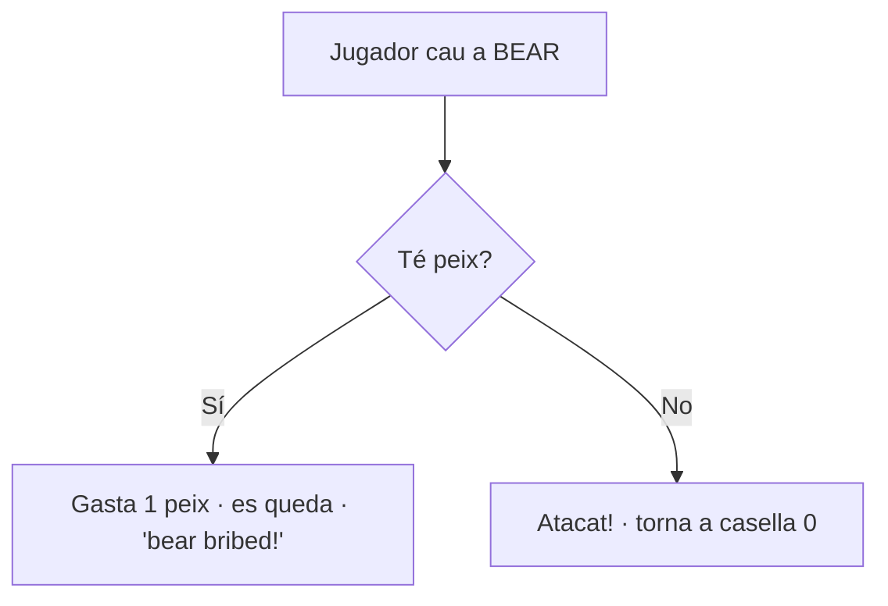
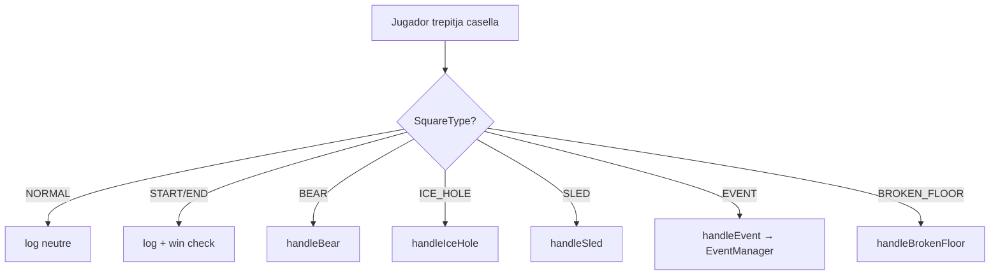

# Caselles Especials

El tauler té **8 tipus de casella** definits a l'enum **`SquareType`** ([[Paquet model.board]]). Quan es genera un tauler nou, el **70%** són casellas normals (`Board.NORMAL_SQUARE_PERCENTAGE = 70`) i el 30% restant es reparteix aleatòriament entre els 5 tipus especials. La casella **0** sempre és `START` i la **49** sempre és `END`.

## Taula resum

| Tipus | Classe | Efecte | Restablible |
|-------|--------|--------|-------------|
| `NORMAL` | [[Paquet model.board\|S_Normal]] | Cap efecte — log neutre | — |
| `START` | [[Paquet model.board\|S_Start]] | Punt de sortida (casella 0) | — |
| `END` | [[Paquet model.board\|S_End]] | Final — victòria | — |
| `BEAR` | [[Paquet model.board\|S_Bear]] | Si tens peix: en gastes un i et quedes. Sinó: tornes a 0. | — |
| `ICE_HOLE` | [[Paquet model.board\|S_IceHole]] | Et tira enrere al forat anterior (o a 0). Congela el sprite. | — |
| `SLED` | [[Paquet model.board\|S_Sled]] | Et tira endavant fins al següent trineu. | — |
| `EVENT` | [[Paquet model.board\|S_Event]] | Esdeveniment aleatori (veure [[Paquet model.board\|EventManager]]) | — |
| `BROKEN_FLOOR` | [[Paquet model.board\|S_BrokenFloor]] | Depèn de quants objectes portis | Es converteix en `ICE_HOLE` si caus |

## NORMAL

Casella de farciment. Només produeix un missatge de log: *"Jugador X landed on a normal square"*. Sense efectes sobre l'estat.

## START i END

- **START** (índex 0): tots els jugadors hi comencen. Els efectes que diuen "torna a l'inici" hi porten el jugador.
- **END** (índex 49): el primer jugador que hi arribi guanya. La detecció final es fa a `PlayerManager.movePlayer()` quan el resultat de la suma supera `MAX_SQUARES - 1`.

## BEAR (🐻 Ós polar)

> [!warning] Compensació
> Els peixos són l'únic recurs que evita perdre tot l'avenç a una casella BEAR.

## ICE_HOLE (🕳️ Forat de gel)

Llista ordenada `Board.IceHole_Array`. Quan caus a un forat, ets enviat **al forat anterior de la llista**. Si caus al primer forat, vas a la casella 0.

> [!tip] Sprite congelat
> A més de moure't, et marca com a `frozen=true` perquè es mostri el sprite gelat (`ice_player_*.png`). Es desbloca quan tornes a tirar el dau.

## SLED (🛷 Trineu)

És l'invers del forat: et tira al **següent trineu** de la llista `Board.Sled_Array`. Si caus al darrer trineu, no et mous.

## EVENT (❓ Esdeveniment aleatori)

Es resol a través de [[Paquet model.board|EventManager.triggerEvent()]] amb les probabilitats següents:

| Probabilitat | Esdeveniment | Efecte |
|--------------|--------------|--------|
| **30%** | `GET_SLOW_DICE` | Reps un dau lent (1-3) si l'inventari no està ple |
| 20% | `GET_SNOWBALLS` | Reps 1-3 boles de neu |
| 15% | `GET_FISH` | Reps un peix |
| 12% | `LOSE_TURN` | Pateixes pell de plàtan: perds el següent torn |
| 10% | `LOSE_ITEM` | Una ràfega de vent et fa caure un objecte aleatori |
| **8%** | `GET_FAST_DICE` | Reps un dau ràpid (5-10) — esdeveniment poc freqüent |
| 5% | `SNOWMOBILE` | Vehicle de neu: avança fins al trineu següent |

> [!info] Sense duplicació
> `S_Event.action()` és buit a propòsit; la resolució autèntica passa al `BoardManager.handleEvent()` que crida l'`EventManager`.

## BROKEN_FLOOR (💔 Terra trencat)

L'efecte depèn de quants **objectes totals** portis (`Inventory.getTotalItemCount()`):

| Items totals | Resultat |
|--------------|----------|
| **> 5** | Caus i tornes a 0. La casella es **transforma en ICE_HOLE** permanentment (`Board.convertBrokenFloorToIceHole`). |
| 1 a 5 | 50% → perds un objecte aleatori. 50% → perds el següent torn. |
| 0 | Sense problemes — passes sense penalització. |

> [!warning] Compromís estratègic
> Acumular molts objectes ajuda contra BEAR i EVENT, però et fa vulnerable a BROKEN_FLOOR. Pensa-t'ho bé.

## Diagrama de resolució (BoardManager)

## Enllaços relacionats

- [[Paquet model.board]] — implementació de cada classe `S_*`
- [[Inventari i Objectes]] — com els objectes afecten les decisions
- [[Flux de Joc]] — seqüència complerta d'un torn
