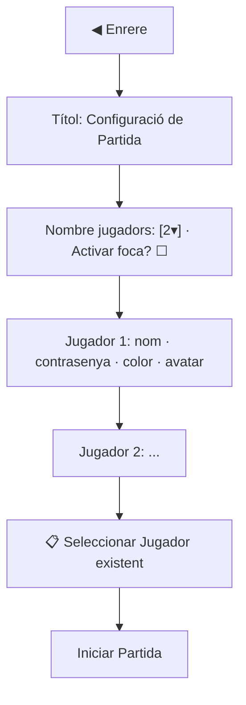
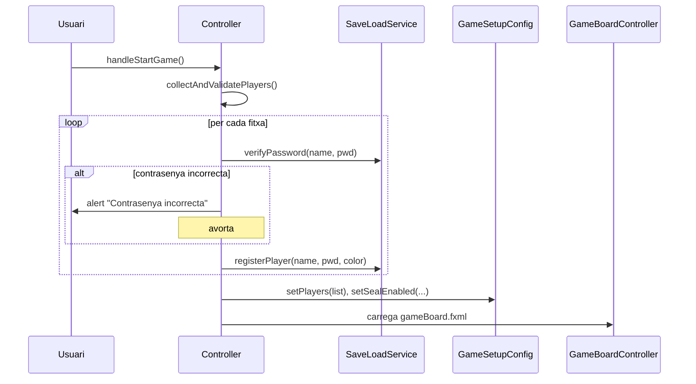

# Configuració de Partida

Pantalla on es prepara una partida nova. Controlada per **`PlayerSetupController`** ([[Paquet controller]]) i descrita a **`playerSetup.fxml`** ([[Paquet view]]).

## Què pots configurar

1. **Nombre de jugadors**: de **1 a 4** (`ComboBox<Integer>`).
2. **Activar foca?**: checkbox que activa la foca CPU com a rival comú.
3. **Per cada jugador**:
   - Nom (`TextField`)
   - Contrasenya (`PasswordField`)
   - Color (`ColorPicker`)
   - Avatar (botó *Tria una imatge d'avatar* → `FileChooser` per PNG/JPG/JPEG/GIF)

## Estructura visual



Quan canvies el nombre de jugadors al desplegable es regeneren les fitxes (`updatePlayerFields`). Cada fitxa és una `VBox` amb classe CSS `setup-card`.

## Seleccionar jugador existent

El botó **📋 Seleccionar Jugador** crida `handleSelectExistingPlayer()`. Mostra un `ChoiceDialog` amb els jugadors ja registrats a la taula `ENTITY` de la BBDD i omple la primera fitxa buida amb les dades del jugador triat (nom, color, contrasenya desencriptada).

> [!warning] Tots els espais plens
> Si totes les fitxes ja tenen nom escrit i no en queda cap buida, es mostra un alert `ALERT_FULL_TITLE` (clau `alert.full.title`).

## Iniciar partida

En fer clic a **Iniciar Partida** s'executa `handleStartGame()`:



> [!info] Validació de contrasenyes
> `SaveLoadService.verifyPassword` busca a la taula `ENTITY`. Si el jugador **no existeix encara** retorna `true` (es considera un alta nova). Si **existeix**, compara la contrasenya escrita amb el valor desencriptat de la BBDD.

## Camps tècnics rellevants

| Camp | Tipus | Significat |
|------|-------|-----------|
| `numPlayersCombo` | `ComboBox<Integer>` | 1, 2, 3 o 4 |
| `sealCheckBox` | `CheckBox` | Activa la foca CPU |
| `playerInputs` | `List<PlayerInput>` | Una fitxa per jugador (classe interna) |
| color | `String` hex (6 dígits) | Es deriva del `ColorPicker` retallant el prefix `0x` i l'alfa |
| avatar | `String` URI | URI del fitxer triat (`file:///...`) |

## El que queda guardat a `GameSetupConfig`

Veure [[Paquet model.config|GameSetupConfig]]:

```java
GameSetupConfig.setPlayers(players);           // List<Player>
GameSetupConfig.setSealEnabled(sealCheckBox.isSelected());
GameSetupConfig.setLoadedGame(false);          // és partida nova, no carregada
```

## Enllaços relacionats

- [[Menú Principal]] — pantalla anterior
- [[Tauler de Joc]] — pantalla següent
- [[Guardar i Carregar]] — com es registren els jugadors a BBDD
