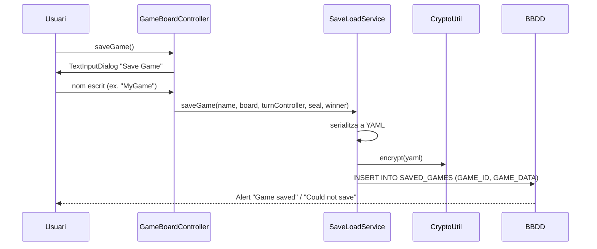
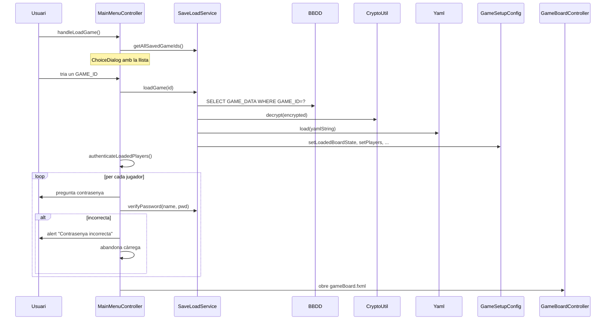

# Guardar i Carregar

El joc permet **desar la partida actual a Oracle** i recuperar-la més tard. Tot ho gestiona **`SaveLoadService`** ([[Paquet model.game]]) amb encriptació AES (veure [[Sistema de Persistència]]).

## Guardar partida

Des del [[Tauler de Joc]], clica **💾 Save Game**. Apareix un `TextInputDialog`:



### Què es desa exactament

L'estructura YAML que es genera (i s'encripta abans de pujar-la a la BBDD):

```yaml
board: [START, NORMAL, ICE_HOLE, NORMAL, ...]   # tipus de cada casella
currentTurn: 2
players:
  - name: Pingu
    color: FF0000
    password: hunter2
    id: 12345
    square: 17
    skipNextTurn: false
    inventory: { snowballs: 3, fish: 1, fastdice: 0, slowdice: 1 }
    eventHistory: [ "🎲5 → ...", ... ]   # màxim 50 entrades
seal:    # només si la foca està activada
  square: 22
  blockedTurns: 0
```

> [!warning] CLOB i PreparedStatement
> El YAML encriptat sovint supera els 4000 caràcters, per això s'insereix amb un `PreparedStatement` cap a un `CLOB` (`GAME_DATA`). Una concatenació amb cometes simples falla amb ORA-01704.

## Carregar partida

Des del [[Menú Principal]] clica **Carregar Partida**:



## Autenticació de jugadors

> [!info] Per què autenticar?
> Així evitem que un altre usuari obri la partida d'algú altre sense permís. Cada jugador ha de saber la seva contrasenya.

A `MainMenuController.authenticateLoadedPlayers()`:

1. Obté els jugadors carregats de `GameSetupConfig.getPlayers()`.
2. Per cada jugador mostra un `Dialog<String>` amb un `PasswordField`.
3. Crida `SaveLoadService.verifyPassword(name, input)`:
   - Recupera la contrasenya **encriptada** de la taula `ENTITY` (clau primària `PLAYERNAME`).
   - Si no hi ha contrasenya guardada → s'accepta només si l'entrada és buida.
   - Sinó → `CryptoUtil.decrypt(stored).equals(input)`.
4. Si una contrasenya falla o l'usuari cancel·la, es torna al menú i es reseteja `setLoadedGame(false)`.

## Registre automàtic de jugadors

Cada vegada que es comença una partida nova, **`SaveLoadService.registerPlayer(name, password, color)`** es crida per cada jugador. Utilitza un `MERGE` SQL:

```sql
MERGE INTO ENTITY e
USING (SELECT 'Pingu' AS pname FROM DUAL) src
ON (e.PLAYERNAME = src.pname AND e.ENTITYTYPE = 'PLAYER')
WHEN MATCHED THEN UPDATE SET PLAYERPASSWORD=..., COLOUR=...
WHEN NOT MATCHED THEN INSERT (...) VALUES (...)
```

Així el jugador s'**actualitza** si ja existeix o s'**insereix** si és nou. La contrasenya es desa encriptada via `CryptoUtil.encrypt()`.

## Estadístiques

`SaveLoadService.recordGameResult()` es crida quan una partida acaba (`handleWin` o victòria de foca). Actualitza dues columnes amb `NVL` (per evitar el problema NULL+1=NULL d'Oracle):

| Columna | Quan s'incrementa |
|---------|-------------------|
| `ENTITY.GAMES_PLAYED` | +1 per cada jugador humà |
| `ENTITY.GAMES_WON` | +1 només per al guanyador (si n'hi ha) |

Les estadístiques es consulten des de [[Menú Principal|Estadístiques]] via `getPlayerStats()`.

## Taules Oracle implicades

| Taula | Columnes rellevants |
|-------|---------------------|
| `ENTITY` | `ENTITYID, ENTITYTYPE='PLAYER', PLAYERNAME, PLAYERPASSWORD (encrypt), COLOUR, GAMES_PLAYED, GAMES_WON` |
| `SAVED_GAMES` | `GAME_ID, GAME_DATA (CLOB encrypted)` |
| `GAME` | `GAMEID, GAMESTATE, GAMEDATE, BOARDID` (insertat a `recordGameResult`) |
| `BOARD` | `BOARDID` (PK referenciada per `GAME.BOARDID`) |

> [!warning] Tracta de SQL injection
> Algunes consultes concatenen strings amb `.replace("'", "''")` com a salvaguarda mínima. Per al projecte didàctic ho deixen així, però en producció caldria fer servir `PreparedStatement` en tot.

## Enllaços relacionats

- [[Sistema de Persistència]] — detalls tècnics i AES
- [[Paquet model.game]] — `SaveLoadService` complet
- [[Paquet model.db]] — capa d'accés a Oracle (`BBDD`)
