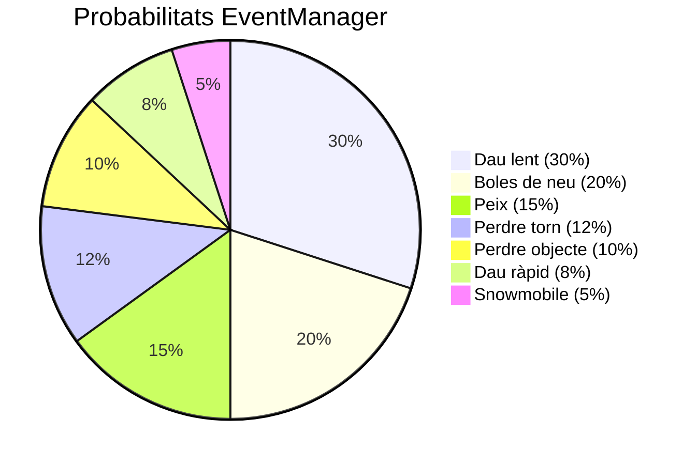
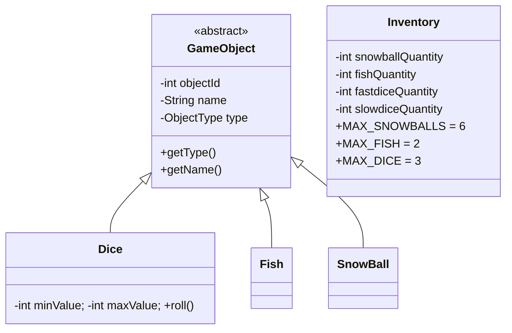

# Inventari i Objectes

Cada [[Paquet model.entity|Player]] té un **`Inventory`** ([[Paquet model.item]]) que emmagatzema quatre tipus d'objectes apilables. La foca CPU no té inventari.

## Objectes disponibles

| Objecte | Tipus (`ObjectType`) | Màxim | Per què serveix |
|---------|----------------------|-------|-----------------|
| ⛄ Bola de neu | `SNOWBALL` | **6** (`MAX_SNOWBALLS`) | Llançar a un altre jugador per fer-lo retrocedir 1-3 caselles |
| 🐟 Peix | `FISH` | **2** (`MAX_FISH`) | Suborna l'ós a `BEAR` o la foca |
| 🎲✨ Dau ràpid | `FASTDICE` | (compartit) | Tira un dau de 5-10 (avenç gran) |
| 🎲 Dau lent | `SLOWDICE` | (compartit) | Tira un dau d'1-3 (avenç curt segur) |

> [!info] Cap total de daus
> Els daus comparteixen una **capacitat conjunta** de 3 (`MAX_DICE = 3`). Pot ser 3 ràpids, 3 lents o qualsevol combinació que sumi 3 — però mai més.

## Com s'obtenen?

Tots els objectes provenen d'una casella **EVENT** (veure [[Caselles Especials]]). Les probabilitats estan a [[Paquet model.board|EventManager]]:



## Boles de neu (Snowball)

Es llancen amb el botó **⛄ Throw Snowball** ([[Tauler de Joc]]). Hi ha dos modes:

1. **Llançament dirigit** (`PlayerManager.throwSnowball`): tries un objectiu, gastes 1 bola, l'objectiu retrocedeix **1-3 caselles** (aleatori) i el seu sprite parpelleja com a *damaged*.
2. **Snowball War** (`PlayerManager.snowballWar`): es dispara automàticament quan dos jugadors caiguin a la **mateixa casella**. Ambdós gasten **totes** les seves boles, qui en tenia més guanya i l'altre retrocedeix per la diferència.

> [!warning] Empat
> Si tots dos en tenen la mateixa quantitat (incloent 0), és empat i ningú retrocedeix.

## Peixos (Fish)

Tenen dues utilitats defensives:

- A casella **BEAR**: subornes l'ós i et quedes (1 peix consumit).
- A casella ocupada per la **foca**: la bloqueges **2 torns** (`Seal.bribeSeal`).

> [!tip] Recurs escàs
> Només pots tenir **2 peixos a la motxilla** (`MAX_FISH = 2`). Si reps un peix amb la motxilla plena, no s'afegeix.

## Daus especials

| Dau | Rang | Mètode `Dice.roll()` |
|-----|------|----------------------|
| Normal (`DICE`) | 1-6 | `roll()` retorna entre `minValue=1` i `maxValue=6` |
| Ràpid (`FASTDICE`) | 5-10 | `FASTDICE_MIN_VALUE..FASTDICE_MAX_VALUE` |
| Lent (`SLOWDICE`) | 1-3 | `SLOWDICE_MIN_VALUE..SLOWDICE_MAX_VALUE` |

L'ús d'un dau especial **el consumeix** (`useObject(FASTDICE, 1)`). Si no en tens, el botó queda deshabilitat:

```java
rollFastDiceButton.setDisable(inv.getFastdiceQuantity() <= 0);
rollSlowDiceButton.setDisable(inv.getSlowdiceQuantity() <= 0);
throwSnowballButton.setDisable(inv.getSnowballQuantity() <= 0);
```

## Mètodes clau de `Inventory`

| Mètode | Què fa |
|--------|--------|
| `addSnowballs(n)` | Afegeix fins a `MAX_SNOWBALLS`, retorna quantes ha afegit |
| `addFish()` | Afegeix 1 si `<MAX_FISH`, retorna booleà |
| `addDice(type)` | Afegeix 1 dau del tipus si `diceQuantity<MAX_DICE` |
| `useObject(type, q)` | Resta del comptador; retorna fals si no n'hi havia prou |
| `removeRandomItem()` | Elimina 1 objecte aleatori; retorna el tipus eliminat o `null` |
| `removeHalf()` | Divideix per 2 totes les quantitats (efecte de la foca passant) |
| `getTotalItemCount()` | Suma de tots (no inclou `DICE` genèric, sí inclou ràpid+lent) |

## Pèrdua d'objectes — quan i com

- **Esdeveniment `LOSE_ITEM` (10%)**: pèrdua aleatòria d'1 objecte.
- **`BROKEN_FLOOR` amb 1-5 objectes (50%)**: pèrdua aleatòria d'1 objecte.
- **`Seal.passThrough()`**: la foca travessa la teva casella → perds la **meitat** de tots els objectes (`Inventory.removeHalf()`).

## Diagrama de classes



## Enllaços relacionats

- [[Caselles Especials]] — d'on surten els objectes
- [[Paquet model.item]] — detalls tècnics
- [[Mode Debug]] — drecera per modificar inventaris durant proves
