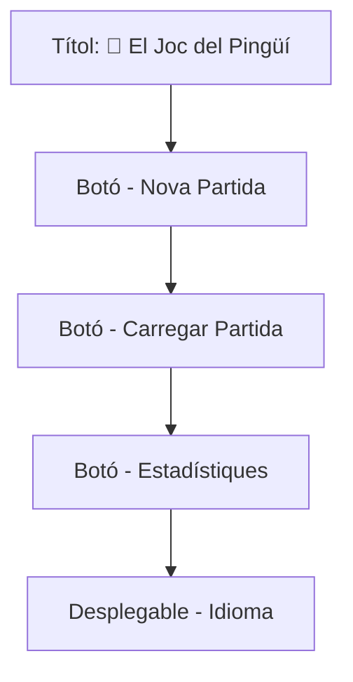
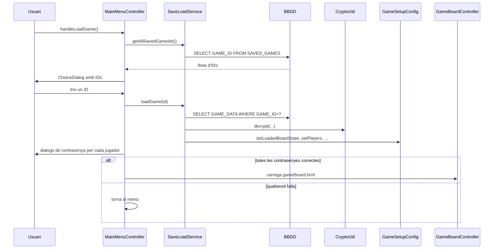

# Menú Principal

És la primera pantalla que apareix en obrir el joc. Controlat per **`MainMenuController`** (veure [[Paquet controller]]) i descrit a **`mainMenu.fxml`** (veure [[Paquet view]]).

## Aparença

Al fons hi ha la imatge `assets/sprites/backgrounds/1.png` carregada des de [[Paquet controller|MainMenuController.addBackgroundImage]]. La música de fons és `main_screen_music.wav` (veure [[Sistema de So]]).

## Botons

| Botó | Mètode FXML | Què fa |
|------|-------------|--------|
| **Nova Partida** | `#handleNewGame` | Carrega `playerSetup.fxml` → [[Configuració de Partida]] |
| **Carregar Partida** | `#handleLoadGame` | Mostra un `ChoiceDialog` amb els `GAME_ID` desats a Oracle |
| **📊 Estadístiques** | `#handleStats` | Carrega `playerStats.fxml` → llista de jugadors registrats |
| **🌍 Idioma** (ComboBox) | listener intern | Crida `LangConfig.loadLang(code)` i refresca tots els textos |

## Selector d'idioma

És un **`ComboBox<String>`** (`language_combobox`) amb 11 entrades. Quan canvia la selecció:

1. Es busca el codi corresponent al nom mostrat (`LangConfig.getDisplayName`).
2. Es crida `LangConfig.loadLang(code)`.
3. Tots els *listeners* registrats amb `LangConfig.addLanguageChangeListener(...)` es disparen i refresquen els seus textos.

Veure [[Idiomes i Localització]] per la llista completa d'idiomes.

## Carregar partida — flux

Quan cliques *Carregar Partida*:

> [!tip] Detall important
> Quan carregues una partida cal **autenticar tots els jugadors un per un** amb la seva contrasenya (veure `authenticateLoadedPlayers()`).

## Cancel·lació segura

Si l'usuari cancel·la el diàleg d'autenticació al carregar una partida, el flag `GameSetupConfig.setLoadedGame(false)` es reseteja per evitar que la pantalla següent es quedi en un estat a mig carregar.

## Enllaços relacionats

- [[Configuració de Partida]] — pas següent en una nova partida
- [[Guardar i Carregar]] — detalls de la persistència
- [[Sistema d'Idiomes]] — detalls tècnics del selector
