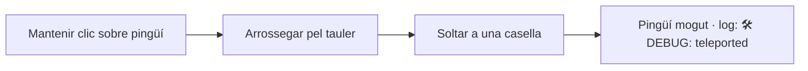

# Mode Debug

> [!warning] Funció oculta
> Aquesta funcionalitat és per a desenvolupadors i testers. **No està anunciada a la UI**, però és perfectament funcional.

## Activació

Quan estiguis al [[Tauler de Joc]], prem la combinació:

**`Ctrl` + `Shift` + `D`**

Apareix un panell groc/negre a la part superior amb:

```
🛠 DEBUG ON   Force next roll: [____] [Set] [Clear]   Drag any 🐧 to teleport.
Inventory of: [jugador▾]   ⛄ - [+/-]   🐟 - [+/-]   🎲✨ - [+/-]   🎲 - [+/-]
```

Pots desactivar-lo prement la mateixa combinació una segona vegada.

## Què pots fer

### 1. Forçar un valor de dau

Escriu un nombre entre **1 i 50** al camp de text i clica **Set**. La pròxima tirada (de qualsevol dau: normal, ràpid o lent) usarà aquest valor en lloc d'un de aleatori. Després es consumeix automàticament.

Útil per provar caselles específiques sense haver de tornar a llençar el dau repetidament.

### 2. Teletransportar un pingüí

Amb el mode debug actiu, **arrossega qualsevol pingüí amb el ratolí** fins a la casella que vulguis. En soltar-lo, el jugador queda a la nova posició.



El cursor canvia a `OPEN_HAND` quan es passa per sobre i a `CLOSED_HAND` mentre s'està arrossegant.

### 3. Modificar inventaris

Al combobox **Inventory of:** tria el jugador. A continuació, pots:

- Clicar **+** per afegir un objecte (respectant els màxims: `MAX_SNOWBALLS=6`, `MAX_FISH=2`, `MAX_DICE=3` total).
- Clicar **−** per treure'n un (si en queda almenys 1).

Els canvis s'apliquen immediatament i el HUD es refresca.

## Per a què serveix?

| Cas d'ús | Com fer-ho |
|----------|-----------|
| Provar la casella d'esdeveniment | Forçar tirada perquè caigui exactament sobre una EVENT |
| Provar BROKEN_FLOOR amb molts items | Afegir 6+ items i teletransportar al pingüí allà |
| Reproduir una partida bug | Teletransportar i ajustar inventaris fins arribar a la situació problemàtica |
| Demostrar la victòria | Forçar un dau alt o teletransportar al pingüí a la casella 48 |

## Limitacions

- El mode **no es desa**: si carregues una partida, t'haurà de reactivar-lo manualment.
- No funciona durant les animacions (haur d'esperar que acabin).
- No pots teletransportar la **foca** (només jugadors humans).

## Enllaços relacionats

- [[Mode Debug Tècnic]] — com està implementat per dins (event filter + drag handlers)
- [[Tauler de Joc]] — la pantalla on s'activa
