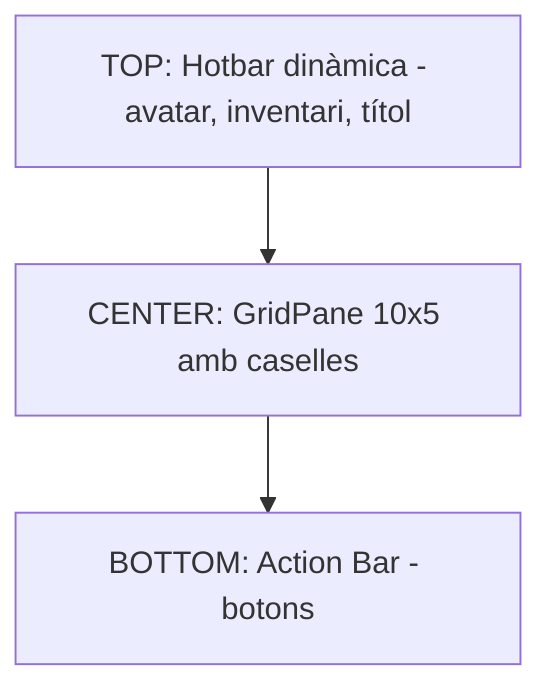
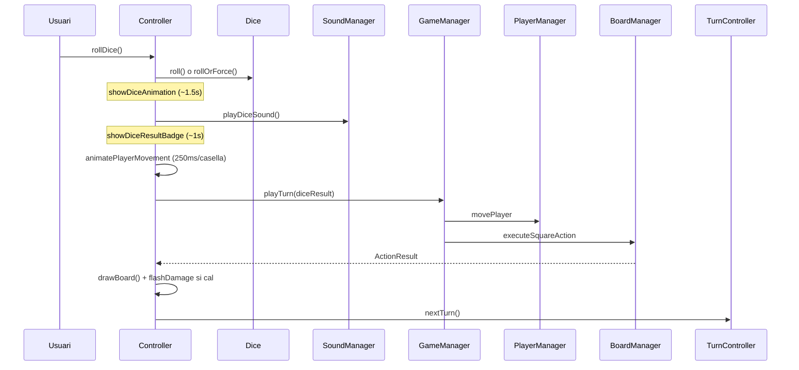

# Tauler de Joc

És la pantalla principal del joc, controlada per **`GameBoardController`** (1780+ línies, vegeu [[Paquet controller]]) i descrita a **`gameBoard.fxml`**.

## Disseny snake (serp)

El tauler és una graella de **10 columnes × 5 files = 50 caselles** (`Board.widthBoard=10`, `Board.heightBoard=5`, `Board.MAX_SQUARES=50`). Les caselles s'ordenen en zig-zag (com una serpent):

```
[ 0][ 1][ 2][ 3][ 4][ 5][ 6][ 7][ 8][ 9]   ← fila 0 (esquerra→dreta)
[19][18][17][16][15][14][13][12][11][10]   ← fila 1 (dreta→esquerra)
[20][21][22][23][24][25][26][27][28][29]   ← fila 2
[39][38][37][36][35][34][33][32][31][30]   ← fila 3
[40][41][42][43][44][45][46][47][48][49]   ← fila 4
```

> [!info] Direcció de mirada
> En files parells (0, 2, 4) els pingüins miren a la **dreta**; en files senars miren a l'**esquerra**. Això ho gestiona `renderPlayersOnCell()` amb la fórmula `rowFacesRight = (row % 2 == 0)`.

## Layout de pantalla (BorderPane)



- **TOP**: una `HBox` construïda dinàmicament a `createHotbar(player)` amb retrat + nom + slots d'inventari + títol del joc.
- **CENTER**: `boardContainer > GridPane#grid` redibuixat a `drawBoard()` cada vegada que es modifica l'estat o canvia la mida de finestra.
- **BOTTOM**: `FlowPane.action-bar` amb els botons d'acció.

## Botons de l'Action Bar

| Botó | Mètode | Què fa |
|------|--------|--------|
| **🎲 Roll Dice** | `#rollDice` | Tira el dau normal (1-6) |
| **🎲✨ Fast Dice** | `#rollFastDice` | Tira un dau ràpid (5-10) si en tens |
| **🎲 Slow Dice** | `#rollSlowDice` | Tira un dau lent (1-3) si en tens |
| **⛄ Throw Snowball** | `#throwSnowball` | Llança una bola de neu a un altre jugador |
| **💾 Save Game** | `#saveGame` | Guarda la partida (demana nom) |
| **📜 History** | `#showEventHistory` | Mostra el log d'esdeveniments |
| **◀ Back** | `#handleBack` | Torna a la pantalla anterior |
| **🏠 Menu** | `#handleReturnToMenu` | Torna al menú principal |

## Tirada de dau



Veure [[Flux de Joc]] per als diagrames complets.

## Gir de torn

Després que el jugador actual completi el seu moviment es crida `endTurn()` que crida `turnController.nextTurn()`. Aquest:

1. Avança l'índex modulant per la mida de la llista.
2. Si el següent jugador té `shouldSkipNextTurn() == true` (efecte d'una casella que el va sancionar), li reseteja el flag i salta una posició més.
3. Si la foca està activada i és el torn 0, primer juga la foca (`playSealTurnAnimated`) i després passa al primer jugador humà.

> [!tip] Pingüí congelat
> Si un jugador ha caigut a un forat de gel a la jugada anterior, el seu sprite està congelat (`isFrozen==true`). En la seva pròxima tirada de dau el flag es treu i el sprite torna a la normalitat. Veure [[Sistema de Sprites]].

## HUD i hotbar

A la part superior es mostra una **hotbar** amb:

- **Retrat** del jugador actual (avatar personalitzat o sprite tintat amb `Lighting` segons el seu color).
- **Nom** del jugador actual.
- **Inventory slots**: només es mostren els objectes que té (snowball, fish, fastdice, slowdice) amb la quantitat com a badge.
- **Títol "Pingu's Game"** centrat com a decoració.

A la dreta (panell `rightPanel`, opcional/ocult per defecte) es pot mostrar informació detallada del jugador, comptadors d'inventari i estat de la foca.

## Estat de la foca

Si `sealEnabled == true`, dins el panell dret apareix un `VBox#sealStatusBox` amb:
- 📍 Posició actual al tauler
- ⚡ Estat (activa) o 😴 *Eating fish (X turns left)* si està bloquejada per un peix.

Veure [[Paquet model.entity|Seal]] per detalls del comportament.

## Esdeveniments del joc

Cada acció (tirada, casella, atac, etc.) genera un `String` que:
- Va al log accessible via **📜 History** (`showEventHistory()`).
- Es desa al `Player.eventHistory` (màxim 50 entrades) perquè sobrevisqui al guardat.

## Enllaços relacionats

- [[Caselles Especials]] — efectes per tipus de casella
- [[Inventari i Objectes]] — com s'utilitzen els objectes
- [[Mode Debug]] — drecera per als desenvolupadors
- [[Sistema de Sprites]] — com es dibuixen els pingüins
- [[Flux de Joc]] — diagrames de seqüència detallats
