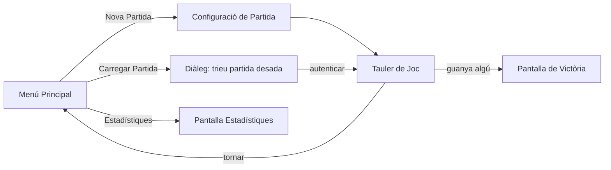

# Visió General

> [!info] En una frase
> *Joc del Pingu* és un joc de taula digital per 1-4 jugadors locals on uns pingüins corren a arribar al final d'un camí de gel evitant ossos, forats i una foca enemiga.

## Resum del joc

- **Format**: taulell snake (serp) de **50 caselles** (10 columnes × 5 files).
- **Jugadors**: 1 a 4 humans al mateix dispositiu, per torns.
- **Antagonista opcional**: una **foca CPU** ([[Paquet model.entity|Seal]]) que també es mou i pot guanyar.
- **Objectiu**: ser el primer en arribar a la casella final.
- **Estil visual**: *pixel-art* a 17×19 píxels per pingüí, amb tintat per color de jugador.

## Requeriments

| Component | Versió mínima |
|-----------|---------------|
| Java | **JDK 21** (mòduls de JavaFX inclosos a `module-info.java`) |
| JavaFX | 21 (graphics, controls, fxml, media, swing) |
| SnakeYAML | qualsevol versió 1.x/2.x |
| Oracle JDBC | `ojdbc8` o superior (per **BBDD del curs**) |
| Sistema | Windows, macOS o Linux amb suport per JavaFX |

> [!warning] Connexió a base de dades
> Sense la BBDD Oracle del curs no es poden desar partides ni veure estadístiques. La connexió està hardcodejada a [[Paquet model.db|BBDD.java]] amb credencials `DW2526_GR06_PINGU` / `ABDJFMV` al host `oracle.ilerna.com:1521/XEPDB2`.

## Com iniciar el joc

1. Obre el projecte a Eclipse (workspace `JocDelPingu`).
2. Comprova que `module-info.java` exporta els paquets necessaris.
3. Executa la classe principal **`controller.main.MainMenu`** (que estén `javafx.application.Application`).
4. S'obre la finestra a 900×720 px amb el [[Menú Principal]].

```java
// Punt d'entrada
public class MainMenu extends Application {
    public static void main(String[] args) {
        LangConfig.loadLang();   // carrega "en.yml" per defecte
        launch(args);
    }
}
```

## Què passa quan arrenques

1. **Càrrega de fonts pixelades** (`pixel-game.regular.otf`, `pixel-game.extrude.otf`, `pixel-unicode-regular.ttf`).
2. **Càrrega del FXML del menú principal** (`mainMenu.fxml`) + l'estil CSS (`style.css`).
3. **Inici de la música de títol** (`main_screen_music.wav`, veure [[Sistema de So]]).
4. Es mostra el [[Menú Principal]] amb els botons traduïts a l'idioma per defecte (anglès).

## Pantalles del joc



Cada bloc està documentat en una pàgina pròpia: [[Menú Principal]], [[Configuració de Partida]], [[Tauler de Joc]], [[Guardar i Carregar]].

## Aprèn més

- Quines caselles existeixen: [[Caselles Especials]]
- Quins objectes hi ha: [[Inventari i Objectes]]
- Com canviar d'idioma: [[Idiomes i Localització]]
- Si ets desenvolupador, comença per [[Arquitectura General]].
